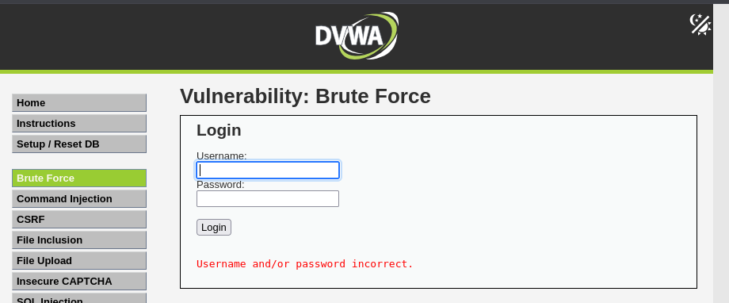
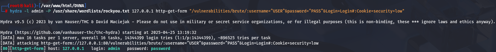

En este primer apartado de DVWA trabajé con la vulnerabilidad de fuerza bruta. Me enfoqué en cómo se puede obtener acceso a un sistema simplemente probando combinaciones de usuario y contraseña, aprovechando la falta de medidas de seguridad.

Nivel Low
Comencé probando manualmente con combinaciones comunes como “admin:admin” y “admin:password”. Me di cuenta de que no existía ningún tipo de protección, como bloqueo de cuenta tras varios intentos fallidos, lo que hace que este tipo de ataque sea viable.

Luego pasé a utilizar Hydra, una herramienta de fuerza bruta. Le pasé un diccionario de contraseñas y en pocos segundos encontró una combinación válida. Esto demuestra que sin mecanismos como CAPTCHA o retardos entre intentos, es muy fácil automatizar ataques.

Vulnerabilidad: Brute Force

Comando utilizado en Hydra para explotar la vulnerabilidad:

