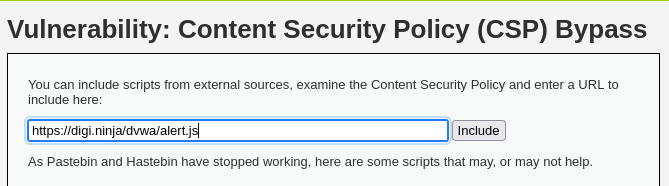
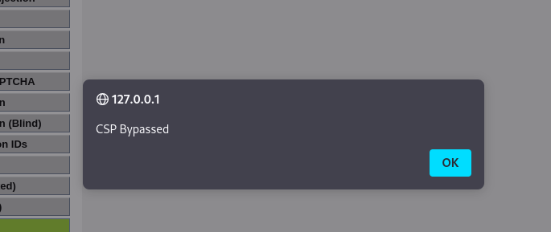
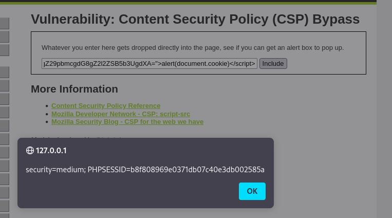

En esta parte aprendí sobre algo llamado CSP, que significa Content Security Policy (Política de Seguridad de Contenidos). Es una medida que las páginas web pueden usar para evitar que se ejecute código no autorizado, como scripts maliciosos.

Pero aquí el reto era justamente lo contrario: intentar saltarse esas políticas de seguridad.

Nivel Low

En el nivel Low, no había ninguna política CSP aplicada (o estaba muy mal configurada), así que simplemente accedi directamente añadiendo la alerta en el campo que luego se mostraba en la página:

Y funcionó perfectamente. La alerta se ejecutó sin problema, lo que significa que la política no estaba bloqueando nada.

Esto demuestra que si no configuras bien CSP, es como si no existiera.

Nivel Medium

En el nivel Medium la cosa se complicó un poco más. Noté que el código que insertaba ya no se ejecutaba directamente. Investigando un poco con las herramientas del navegador, descubrí que para poder ejecutar un <script> en ese entorno, necesitaba un atributo especial llamado nonce.

Un nonce es un valor aleatorio que el navegador espera ver en los scripts para permitir que se ejecuten.

