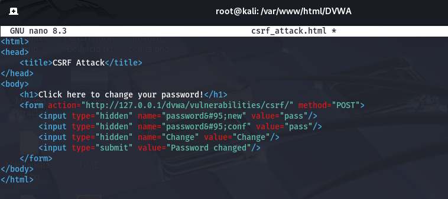
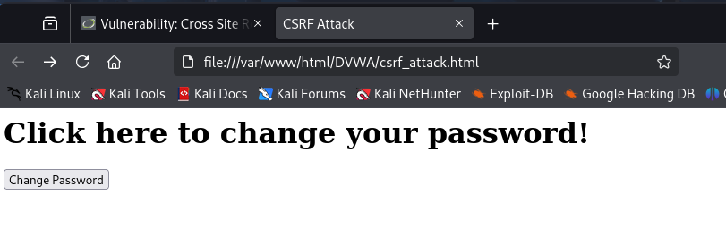
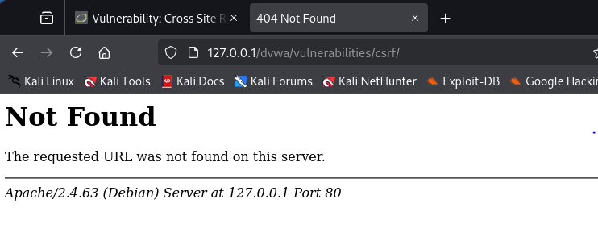
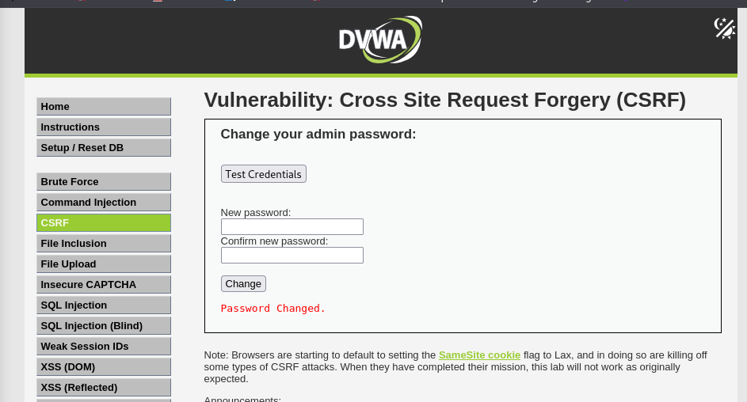

En esta parte de la práctica trabajé con una vulnerabilidad que al principio me costó entender, llamada CSRF, que significa algo como “falsificación de petición cruzada”. Básicamente, se trata de engañar a un usuario que ya ha iniciado sesión para que, sin querer, haga algo en la web (como cambiar una contraseña), pero sin que él lo sepa.

Nivel Low
En este nivel, la seguridad era muy básica, casi inexistente. La aplicación permite cambiar la contraseña de un usuario, pero no verifica si realmente eres tú el que quiere hacer ese cambio.

Lo que hice fue crear un archivo HTML. Dicho archivo será para crear un formulario sencillo para enviarlo automáticamente y cambiar la contraseña.

A continuación, abrimos el archivo en el navegador y nos aparecera para cambiar la contraseña.

Deberemos seleccionar "Change Password" y asi automaticamente se cambiara la contraseña. Como se pude observar en la siguiente imagen, nos aparecerá un error.

Pero si observamos DVWA nos indicara que la contraseña se ha actualizado con exito.

