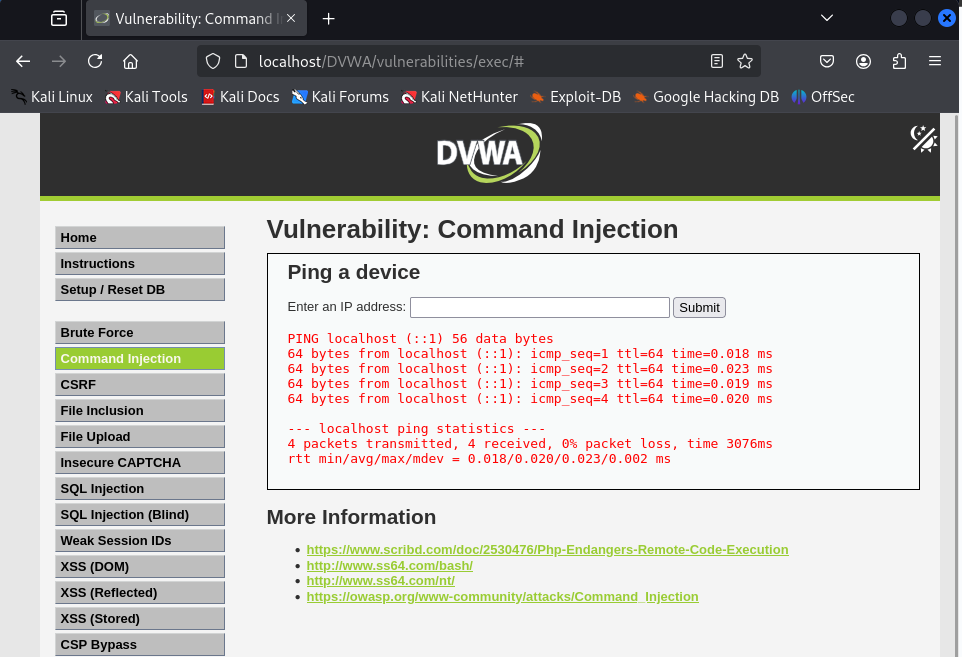
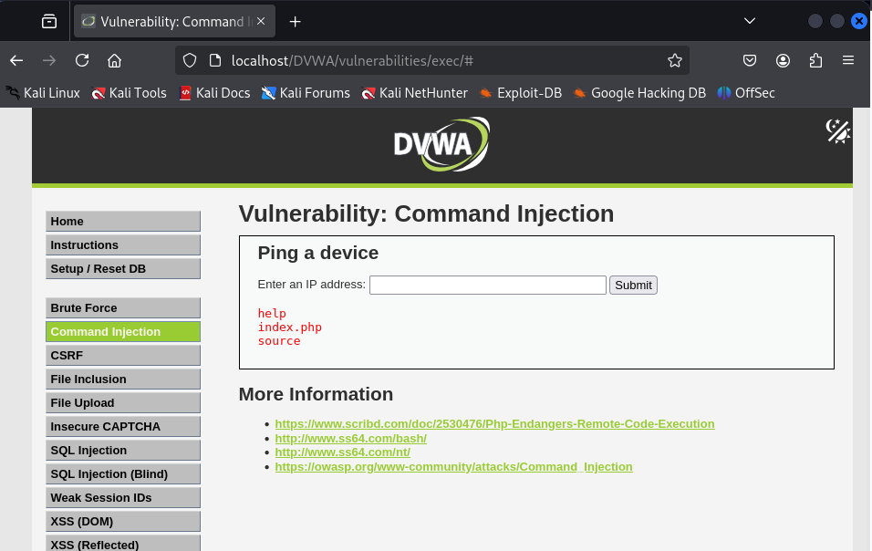

En este apartado trabajé con la vulnerabilidad conocida como Command Injection, que se produce cuando los datos introducidos por el usuario se utilizan directamente en comandos del sistema operativo sin ser validados o filtrados adecuadamente.

Primero probé el nivel Low, que está totalmente desprotegido. Introduje una IP cualquiera como se solicita (por ejemplo, 127.0.0.1) y comprobé que el sistema hacía un ping a esa dirección.

Luego, inyecté un comando adicional usando un operador (|) para que se ejecutara otro comando después del ping. Use el comando (| ls).

Esto causó que el servidor listara los archivos del directorio actual con ls. En la salida se podía ver claramente los nombres de los ficheros, lo cual indica que la entrada del usuario se está ejecutando directamente en el sistema.

Este apartado me permitió comprender mejor lo peligrosa que puede ser una inyección de comandos. A través de una simple entrada como un campo de IP, se puede ejecutar cualquier comando del sistema operativo, lo que podría dar lugar a una escalada de privilegios, robo de información o incluso control total del servidor.
