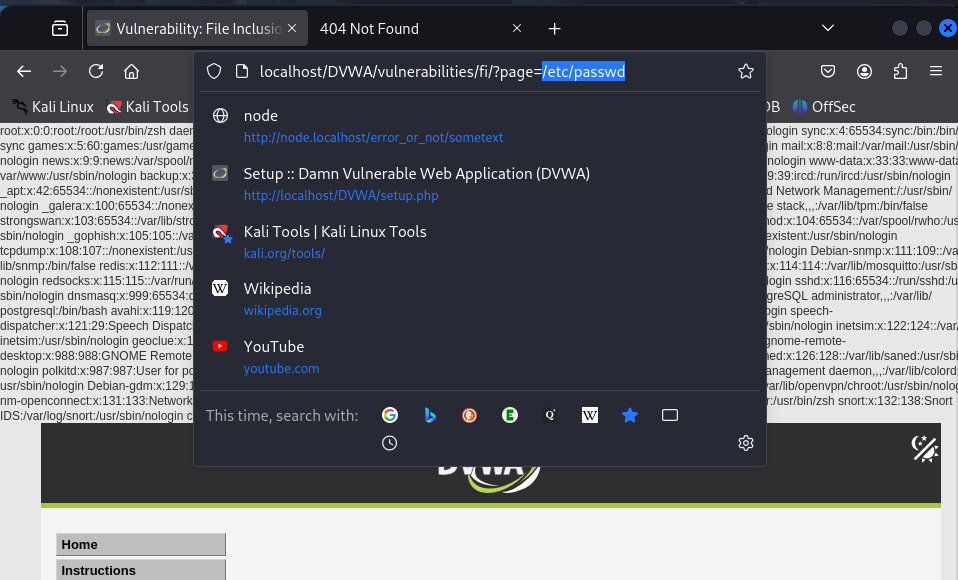
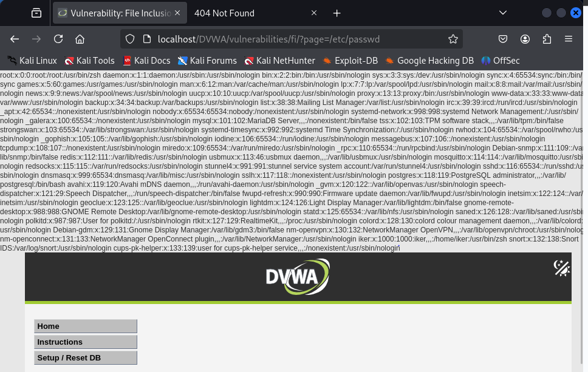

Este apartado trata sobre una vulnerabilidad llamada File Inclusion, que en español sería algo como “inclusión de archivos”. Es cuando una página web te deja cargar archivos dentro de ella (normalmente para mostrar algo), pero sin controlar bien qué archivos estás incluyendo, lo cual puede ser muy peligroso.

Nivel Low

En este nivel, lo que hice fue mirar la URL de la página mientras navegaba entre los menús. Me di cuenta de que había algo como esto: http://localhost/dvwa/vulnerabilities/fi/?page=include.php

Probé a poner un archivo del sistema, como por ejemplo: /etc/passwd

Se cargó el archivo passwd, que es un archivo del sistema Linux donde aparecen los usuarios registrados.

Esto me enseñó que la web está tomando directamente el valor que le damos en la URL y lo usa para abrir un archivo. Como no hay ningún tipo de control, puedes hacer que abra archivos que no debería mostrar.

Nivel Medium

En el nivel Medium, probé lo mismo y también funcionó. No había mucha diferencia con el nivel Low. Tal vez hay algún intento de validar lo que se pone en la URL, pero si lo hay, no es suficiente para frenar el ataque.

En ambos niveles fue posible cargar archivos del sistema.
