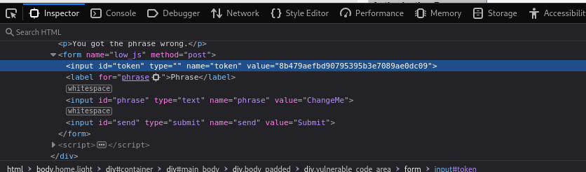
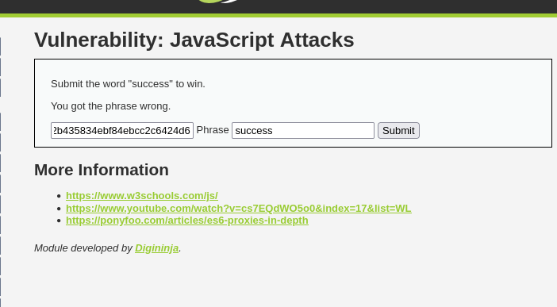
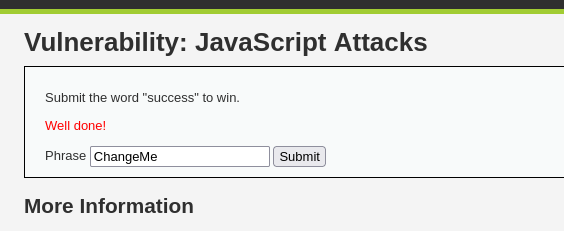
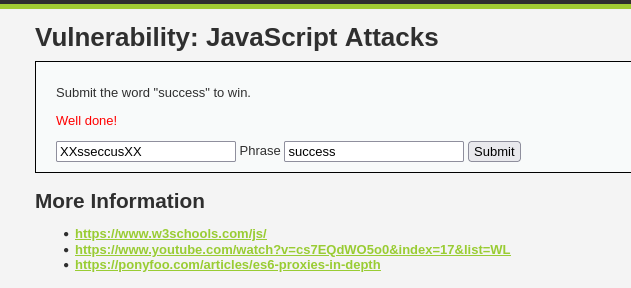
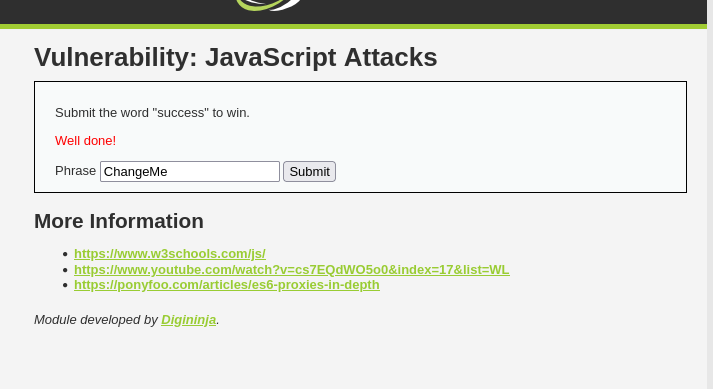

En esta última sección trabajé con ataques que se hacen usando únicamente JavaScript. Aquí no estamos hablando de inyecciones desde formularios o desde la URL, sino de manipular directamente el comportamiento de la web desde el navegador.

Nivel Low

La página tenía una funcionalidad en la que se usaba una especie de cifrado para verificar un "token" secreto. Investigando un poco con las herramientas del navegador, vi que:

- El texto que se escribía era cifrado primero con ROT13 (una sustitución de letras simple) y luego convertido a MD5 (un tipo de hash).

- El sistema comparaba ese hash con un valor esperado para decidir si mostrar el mensaje de "Success".

Entonces hice lo siguiente:

- Cambié el token en el navegador (con "Inspeccionar" > Aplicación > Cookies o directamente en el código), sustituyendo el que estaba por el mío y quitando el hidden para poder observar el token secreto.

- Le añadi la palabra succes al token secreto. 

- Recargué la página, y apareció el mensaje de éxito.

Nivel Medium

Aquí el sistema era diferente. El token era una palabra simple (changeme), pero escrita al revés y encerrada entre dos xx, así que el valor correcto era: xxemegnahcxx

Usando las herramientas del navegador, hice visible el token, lo sustituí por xxsseccusxx (es decir, la palabra success al revés y con los xx) y escribí success en el campo.

Al hacerlo, el sistema aceptó el valor como válido y mostró el mensaje de éxito.

Todo esto demuestra que, aunque el sistema parece tener un control, en realidad se basa en trucos fáciles de romper, y con un poco de análisis desde el navegador se puede ver y modificar todo.

