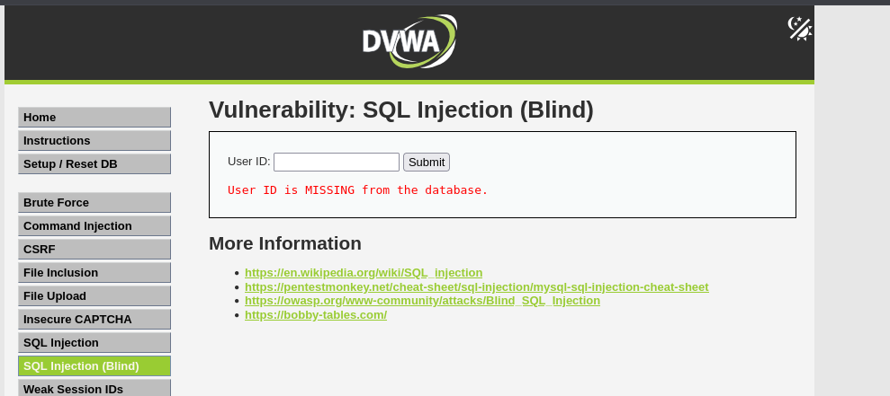

En este apartado trabajé con una variación de la inyección SQL llamada "Blind SQL Injection", que significa "inyección SQL ciega". Se llama así porque, a diferencia de la anterior, no muestra directamente los resultados de lo que estás haciendo. Es como si intentaras adivinar a ciegas si la base de datos ha hecho lo que tú querías.

Nivel Low

Probé con un número cualquiera, como 1, y la web mostraba información del usuario.

Después intenté un payload como:

Este comando le dice a la base de datos: “Si esta consulta funciona, espera 5 segundos antes de responder”.

Y lo hizo. La página tardó en cargar, lo que me demostró que el código que puse se estaba ejecutando, aunque no mostrara ningún mensaje o resultado. Eso me confirmó que la inyección funcionaba y que podía usar este tipo de trucos para obtener información poco a poco, por ejemplo, comprobando si ciertos usuarios existen, si ciertas condiciones se cumplen, etc.

Nivel Medium

En el nivel Medium, la página parecía tener más filtros, pero seguía siendo vulnerable. Utilicé un payload un poco diferente, pero con el mismo objetivo. Y otra vez, el servidor tardó unos segundos en responder, lo que es una clara señal de que el código fue ejecutado. Aunque no veía nada en pantalla, esa demora me permitió saber que la base de datos está funcionando de una manera que se puede manipular.
