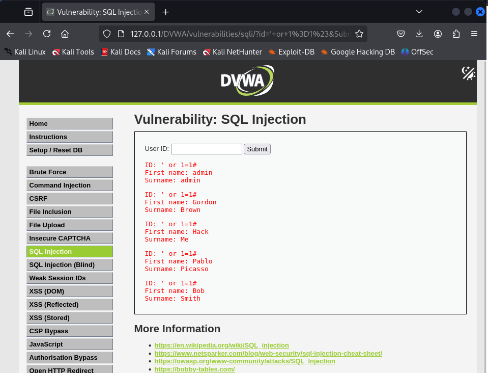
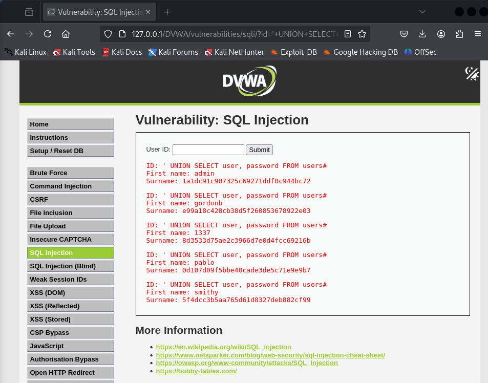
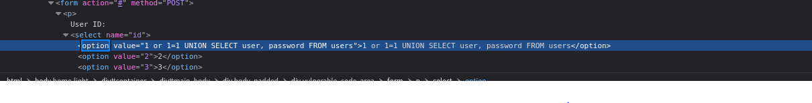
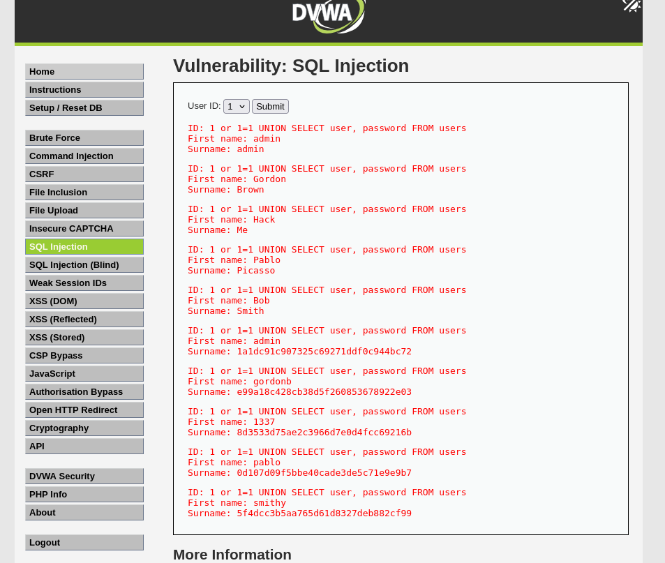

Este apartado trata sobre la inyección SQL, una de las vulnerabilidades más conocidas y peligrosas en aplicaciones web. Básicamente, se trata de aprovecharse de una web que no protege bien las consultas a la base de datos, y meterle "código" para sacar información que no deberíamos ver.

Nivel Low

Aquí había un formulario donde introducías el ID de un usuario, y la web te devolvía el nombre y los datos de ese usuario.

Probé primero con un número normal (1) y salía la información del usuario 1.

Después intenté una inyección muy típica: 1' or 1=1.

Y eso hizo que el sistema mostrara todos los usuarios de la base de datos. Esto funciona porque la consulta queda manipulada para que siempre sea verdadera (1=1), y el resto se ignora gracias a los símbolos --.

También probé otros payloads similares y todos funcionaron sin ningún tipo de validación.

Nivel Medium

En este nivel parecía que ya no aceptaba directamente ese tipo de texto. Sin embargo, usé las herramientas del navegador (Inspeccionar > Red) para modificar manualmente la petición que se enviaba, y allí puse el mismo payload que antes.

El resultado fue el mismo: me mostró todos los usuarios, lo que demuestra que el filtro solo estaba en el lado del cliente (el navegador), pero la base de datos seguía siendo vulnerable.

Modificanción del navegador:

