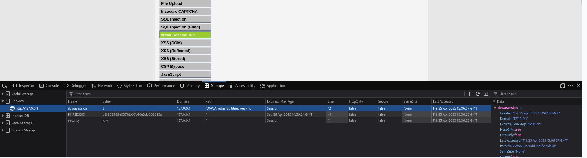
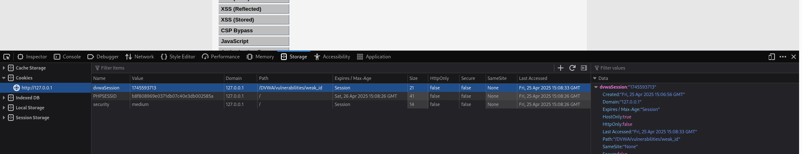

En esta parte de la práctica investigué cómo se generan las cookies de sesión que utiliza la aplicación para identificar a los usuarios cuando inician sesión. Me di cuenta de que, si estas cookies se generan de forma predecible, un atacante podría adivinarlas y entrar en la cuenta de otra persona sin necesidad de usuario ni contraseña.

Nivel Low

En el nivel Low, inicié sesión y abrí las herramientas del navegador (Inspeccionar > Aplicación > Cookies). Allí vi una cookie llamada PHPSESSID.

Lo sorprendente fue que era un número muy simple, como por ejemplo: 1, 2, 3… Cada vez que iniciaba sesión o abría una nueva ventana, el número subía uno. Es decir, si mi sesión tenía el ID 4, podía adivinar que alguien antes tenía el 3 y el siguiente tendría el 5.

Esto me hizo ver que los IDs de sesión no estaban siendo generados de forma segura, sino simplemente contados como si fuera un turno. Eso significa que alguien con un poco de conocimiento puede conectarse a sesiones activas adivinando los números.

Nivel Medium

En el nivel Medium parecía que las cookies eran un poco más complejas. Ya no eran números seguidos, sino que tenían letras y números mezclados.

Pero al analizarlas con más calma, descubrí que muchas estaban basadas en la fecha y la hora, o algún tipo de patrón parecido. Incluso vi en internet que hay herramientas que te ayudan a entender cómo se generan y te pueden ayudar a predecir los valores.

Esto significa que, aunque parecía más seguro, sigue sin ser aleatorio del todo, y eso hace que el sistema también sea vulnerable.

