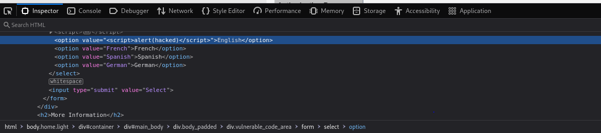
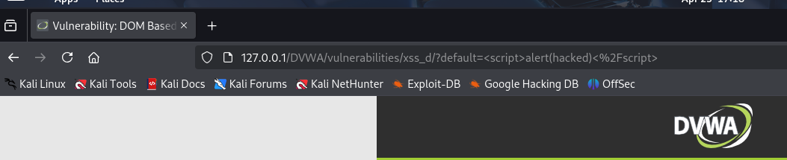
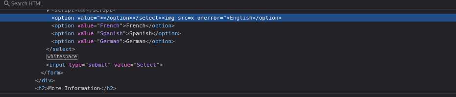
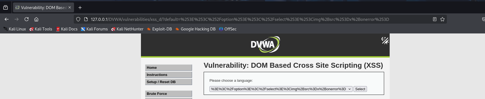

En este apartado aprendí sobre una forma de ataque llamada XSS basado en DOM. A diferencia de otros tipos de XSS, aquí el problema no está tanto en lo que devuelve el servidor, sino en cómo el navegador interpreta y construye la página usando JavaScript.

Lo que haces es inyectar código malicioso en una parte de la web que el navegador procesa directamente desde la URL, y eso puede causar que se ejecute sin que el servidor tenga nada que ver.

Nivel Low

En el nivel Low encontré que había una parte de la web donde podías seleccionar el idioma, y eso cambiaba la URL. Por ejemplo:

Cuando cargué la página con esa URL, se modifico la URL, lo que confirmaba que el navegador estaba ejecutando el código que yo inyecté. Eso es una prueba clara de XSS DOM, porque el script lo ejecutó el navegador al construir la página con lo que había en la URL.

Nivel Medium

En el nivel Medium, el nivel de protección era un poco mayor, y ese mismo payload no funcionaba.

Entonces cambié de técnica. En lugar de usar <script>, utilicé una etiqueta  falsa con un error intencional, así:

Y pude comprobar el resultado:

