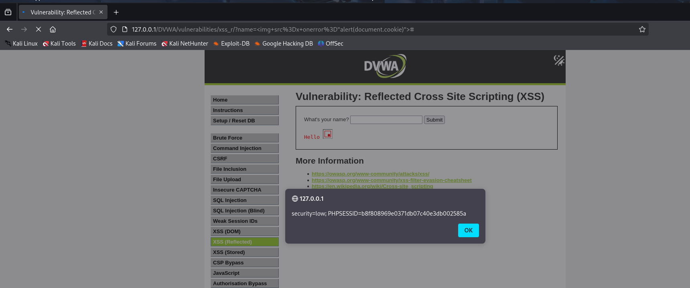
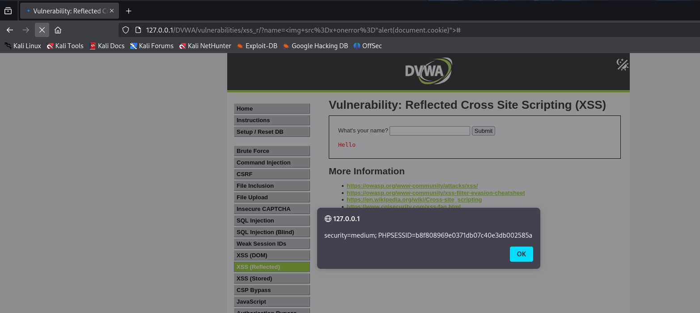

En este apartado trabajé con otro tipo de XSS, llamado Reflected XSS, o "XSS reflejado". A diferencia del DOM-based, aquí el ataque sí pasa por el servidor, pero el servidor te lo devuelve directamente sin filtrarlo, y el navegador lo ejecuta al momento.

Se llama "reflejado" porque el contenido que tú envías (por ejemplo, en un formulario o en la URL) es devuelto tal cual por la web en la respuesta, y eso permite que se ejecute código si no está protegido.

Nivel Low

En el nivel Low, había un formulario donde podías escribir tu nombre y salía en pantalla algo como "Hello, [tu nombre]".

En lugar de poner un nombre normal, escribí: "" y me mostro lo siguiente.

Y al enviar el formulario, apareció una alerta, lo que significa que el navegador ejecutó el código malicioso que escribí.

Eso demostró que la página no filtra nada de lo que escribes, y simplemente lo muestra directamente en la respuesta.

Nivel Medium

En el nivel Medium, volví a hacer lo mismo y funcionó igual.

No había ninguna diferencia notable entre ambos niveles. La web seguía mostrando lo que yo escribía sin ningún tipo de validación, lo que hace que el XSS funcione sin problema.

