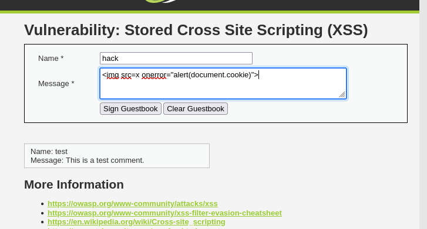
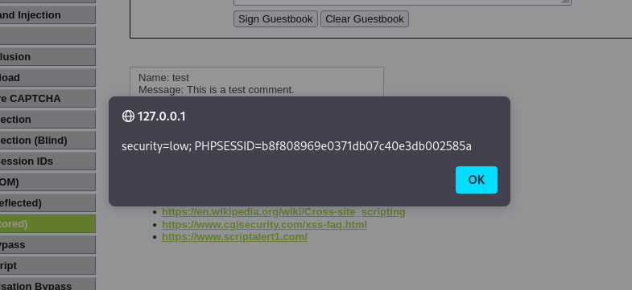
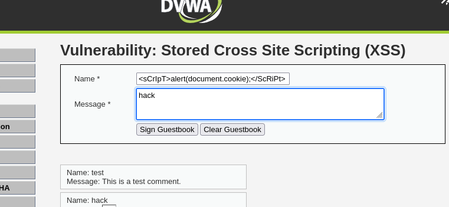
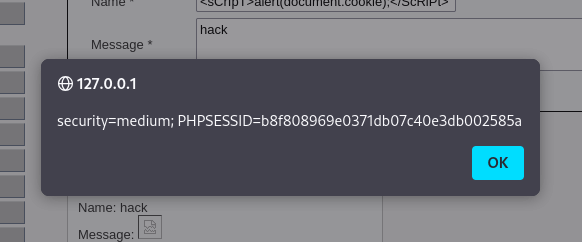

En esta parte de la práctica aprendí sobre el XSS almacenado (Stored XSS), que es posiblemente el tipo de XSS más grave. A diferencia de los anteriores, aquí el código malicioso se guarda en la base de datos o en el servidor, y se ejecuta automáticamente cada vez que alguien entra en esa página, sin que tenga que hacer clic en nada raro.

Esto puede afectar a todos los usuarios que visiten esa sección de la web, incluso administradores.

Nivel Low

En el nivel Low, encontré un formulario donde podías dejar comentarios o mensajes. En el campo de “descripción” escribí el siguiente código:

Cuando le di a "Sign Guestbook", se ejecutó automáticamente la alerta, lo que demuestra que el script fue guardado y luego ejecutado al mostrar los datos. No había ningún filtro ni control.

Es decir, cualquier persona que visite esa página va a ejecutar el código malicioso, y eso podría ser algo mucho peor que un alert, como robar cookies, redirigir a otra web o tomar el control del navegador.

Nivel Medium

Aquí sí había una pequeña protección: no me dejaba escribir tantas letras en el campo, parecía haber una restricción de longitud.

Pero usé el truco de ir al navegador, hacer clic derecho en el campo, seleccionar "Inspeccionar", y ahí cambié el límite de caracteres directamente desde el HTML (por ejemplo, de maxlength="50" a maxlength="500").

Después de eso, escribí el payload, envié el formulario y funcionó. Se ejecutó el mismo mensaje. Esto me mostró que la restricción estaba solo en el navegador, y que se puede saltar fácilmente si sabes cómo.

