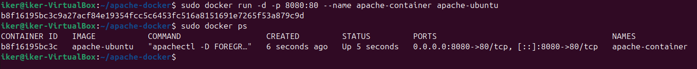
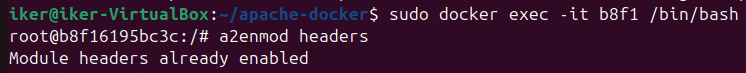

# 🔒 Apache Hardening: Implementación de HSTS y CSP

## 📌 ¿Qué vamos a realizar en este repositorio?

Este repositorio documenta cómo fortalecer la seguridad de un servidor Apache implementando dos políticas clave: **HSTS (HTTP Strict Transport Security)** y **CSP (Content Security Policy)**. Se detallarán los conceptos de cada una, su propósito, y los pasos necesarios para aplicarlas y probarlas en un entorno controlado con Docker.

---

## 📖 Introducción

Las cabeceras HTTP como **HSTS** y **CSP** permiten a los administradores web proteger a los usuarios de varios tipos de ataques comunes, incluyendo:

- **HSTS**: evita ataques de tipo *man-in-the-middle* forzando el uso de HTTPS.
- **CSP**: protege contra ataques de *cross-site scripting (XSS)* y otras inyecciones de contenido.

Este documento detalla paso a paso cómo configurar estas políticas para fortalecer la seguridad del servidor Apache.

---

## ⚙️ Requisitos previos

Antes de comenzar, se requiere:

- Un contenedor Docker corriendo Apache (por ejemplo, basado en `httpd`).



- Acceso al terminal **dentro del contenedor** de Apache.



---

## 🔐 Implementación de HSTS (HTTP Strict Transport Security)

### 🧠 ¿Qué es HSTS?

**HSTS** es una cabecera de seguridad que indica a los navegadores que deben comunicarse únicamente a través de HTTPS con el servidor. Esto **previene el downgrade a HTTP**, protegiendo contra ataques de intermediarios (MitM).

### 🛠️ Cómo habilitarlo en Apache

1. Abre el archivo de configuración del sitio:
   ```bash
   nano /usr/local/apache2/conf/httpd.conf
