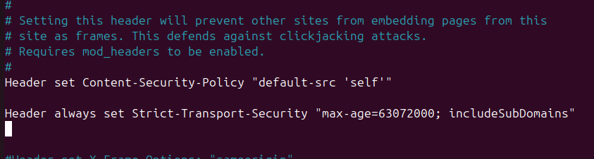
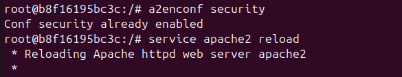
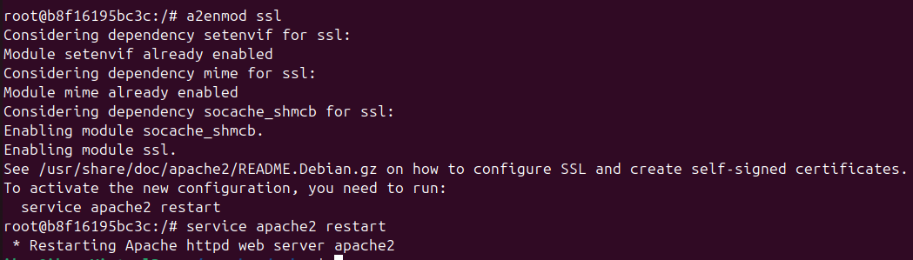
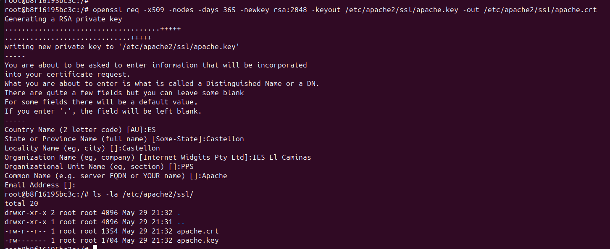
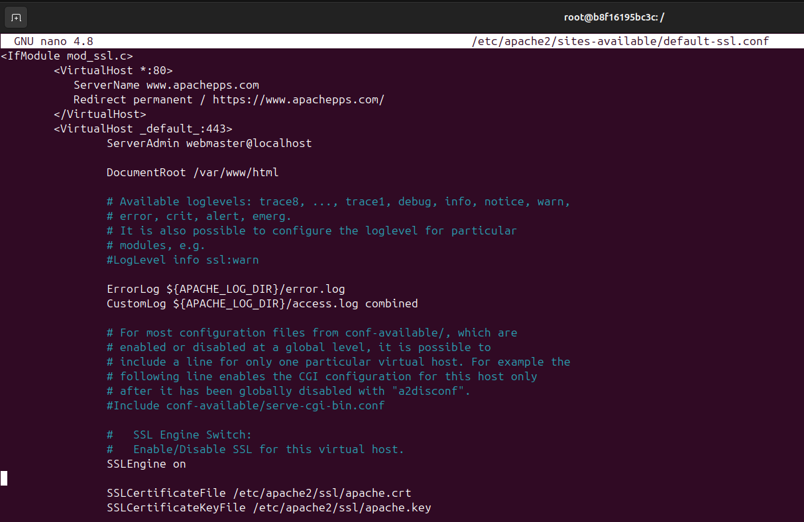
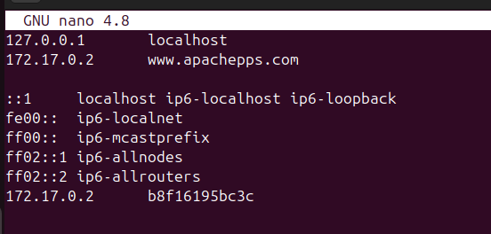
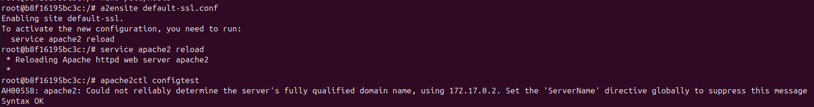
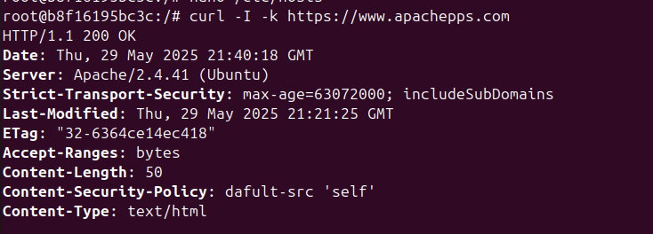
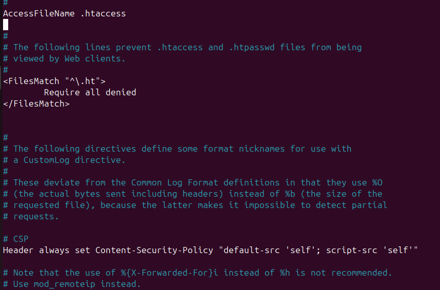
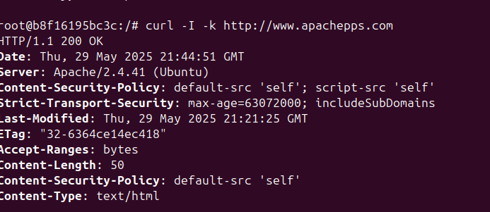

# 🔒 Apache Hardening: Implementación de HSTS y CSP

## 📌 ¿Qué vamos a realizar en este repositorio?

Este repositorio documenta cómo fortalecer la seguridad de un servidor Apache implementando dos políticas clave: **HSTS (HTTP Strict Transport Security)** y **CSP (Content Security Policy)**. Se detallarán los conceptos de cada una, su propósito, y los pasos necesarios para aplicarlas y probarlas en un entorno controlado con Docker.

---

## 📖 Introducción

Las cabeceras HTTP como **HSTS** y **CSP** permiten a los administradores web proteger a los usuarios de varios tipos de ataques comunes, incluyendo:

- **HSTS**: evita ataques de tipo *man-in-the-middle* forzando el uso de HTTPS.
- **CSP**: protege contra ataques de *cross-site scripting (XSS)* y otras inyecciones de contenido.

Este documento detalla paso a paso cómo configurar estas políticas para fortalecer la seguridad del servidor Apache.

---

## ⚙️ Requisitos previos

Antes de comenzar, se requiere:

- Un contenedor Docker corriendo Apache (por ejemplo, basado en `httpd`).


- Acceso al terminal **dentro del contenedor** de Apache.


---

## 🔐 Implementación de HSTS (HTTP Strict Transport Security)

### 🧠 ¿Qué es HSTS?

HSTS (HTTP Strict Transport Security), es una política de seguridad web establecida para evitar ataques que puedan interceptar comunicaciones, cookies, etc. Según este mecanismo un servidor web declara que los agentes de usuario compatibles (es decir, los navegadores), solamente pueden interactuar con ellos mediante conexiones HTTP seguras (es decir, en HTTP sobre TLS/SSL1). HSTS es un estándar del IETF y se especifica en el RFC 6797.

### 🛠️ Cómo habilitarlo en Apache

### **1. Habilitar el módulo `headers` en Apache**
```bash
a2enmod headers
```
### **2. Editar la configuración de Apache**
```bash
nano /etc/apache2/conf-available/security.conf
```


### Explicación de los parámetros:
- **`max-age=63072000`** →  Indica que los navegadores deben recordar esta política durante **2 años**(en segundos). 
- **`includeSubDomains`** → Aplica la política a todos los subdominios del dominio actual.

### **3. Activar la configuración y reiniciar Apache**
```bash
a2enconf security

service apache2 reload
```


### **4. Antes de verificar que HSTS está activo, debemos certificar nuestro dominio**
Para garantizar que el tráfico cifrado es confiable, necesitamos configurar un certificado digital para nuestro servidor Apache.

# 🔒 Implementación de un certificado digital en Apache

### ¿Qué es un certificado digital?

Un certificado digital es un archivo electrónico que sirve para identificar de forma segura a una persona, entidad o dispositivo en internet. Funciona como una especie de “pasaporte digital” que confirma la identidad del titular y permite establecer conexiones cifradas mediante **SSL/TLS**. 

### **1. Activar el módulo SSL en Apache**
```bash
a2enmod ssl
```


### **2. Crear un Certificado SSL Auto-firmado**
Generamos un certificado autofirmado válido por 1 año (365 días) con clave de 2048 bits:
```bash
mkdir /etc/apache2/ssl

openssl req -x509 -nodes -days 365 -newkey rsa:2048 -keyout /etc/apache2/ssl/apache.key -out /etc/apache2/ssl/apache.crt
```


### **3. Configurar Apache para usar el Certificado SSL**
```bash
nano /etc/apache2/sites-available/default-ssl.conf
```
Agregamos la siguiente configuración dentro de `<VirtualHost *:80>`:
```bash
ServerName www.midominioseguro.com
Redirect permanent / https://www.apachepps.com/
```
Y tammbién agregamos dentro de `<VirtualHost *:443>` esta configuración:
```bash
SSLEngine on
SSLCertificateFile /etc/apache2/ssl/apache.crt
SSLCertificateKeyFile /etc/apache2/ssl/apache.key
```


### **4. Configurar /etc/hosts**
```bash
nano /etc/hosts
```


### **5. Activar el sitio SSL y reiniciar Apache**
```bash
a2ensite default-ssl.conf

service apache2 reload

apache2ctl configtest
```


Para verificar que la conexión SSL está activa y el certificado funciona correctamente:
```bash
curl -I -k https://www.apachepps.com
```


## 🛡️ Implementación de CSP (Content Security Policy)

### ¿Qué es CSP?

CSP (Content Security Policy) es una política de seguridad web que permite a los administradores controlar qué recursos (como scripts, estilos, imágenes, etc.) puede cargar un navegador desde una página web. Su objetivo principal es mitigar ataques como el Cross-Site Scripting (XSS) y otras inyecciones de código malicioso, limitando las fuentes externas desde las que se pueden ejecutar contenidos.

### **1. Editar la configuración de Apache**
```bash
nano /etc/apache2/conf-available/security.conf
```
Y añadimos la siguiente línea:

```apache
Header set Content-Security-Policy "default-src 'self'; script-src 'self'"
```


Además, editar también el archivo apache2.conf y tambien añadimos la misma política de seguridad:
```bash
nano /etc/apache2/apache2.conf
```


### **2. Aplicar la configuración**
```bash
service apache2 reload
```

---

### **3. Comprobación Final**

Para comprobar que **Apache está bien configurado y activo con HSTS y CSP**, usa:
```bash
curl -I http://www.apachepps.com
```



