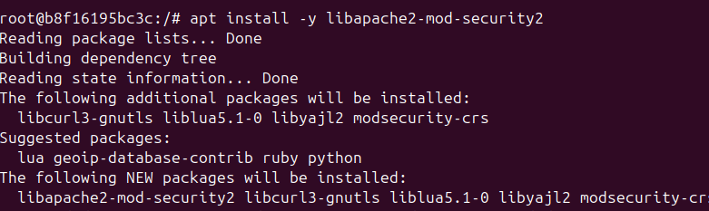
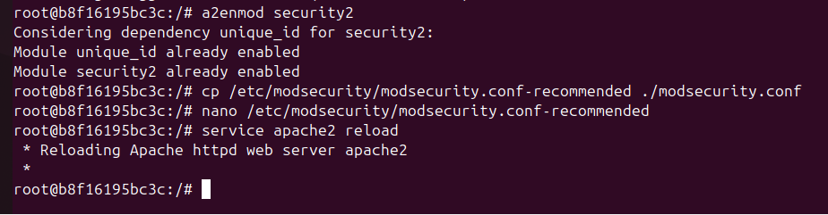
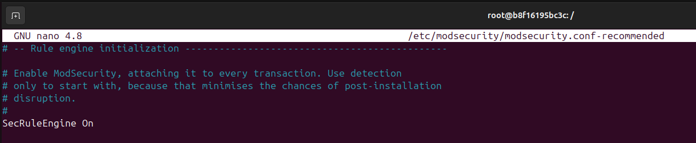

# 🛡️ Hardening de Apache: Implementación de un WAF con ModSecurity

## 📘 Descripción

En este apartado del hardening de Apache, implementaremos un **WAF (Web Application Firewall)** utilizando **ModSecurity**, una herramienta poderosa que permite monitorear, registrar y bloquear solicitudes HTTP maliciosas. Esta medida incrementa la capacidad defensiva de nuestro servidor frente a ataques web como inyecciones SQL, XSS, y otros vectores comunes.

---

## 🧩 Introducción

**WAF (Web Application Firewall)** actúa como una capa adicional de protección entre el cliente y el servidor web. Analiza el tráfico entrante y saliente y permite aplicar reglas para detectar y bloquear solicitudes peligrosas. En este caso, lo integraremos con Apache utilizando **ModSecurity**, que es uno de los WAFs más utilizados en el mundo open source.

ModSecurity se puede ejecutar en modo detección (solo registra) o en modo bloqueo (previene ataques), y puede utilizar conjuntos de reglas como el **OWASP Core Rule Set (CRS)**, ampliamente reconocidos por cubrir muchas amenazas comunes.

---

## ⚙️ Requisitos Previos

- Tener Docker instalado y funcionando en el sistema.
- Tener una imagen de Apache que soporte o permita añadir **ModSecurity**.
- Acceso a terminal para construir e iniciar contenedores.

---

## 🔧 Implementación del WAF con ModSecurity

Desde el terminal donde Apache está corriendo dentro de un contenedor Docker:

### **1. Instalar ModSecurity**
```bash
apt install -y libapache2-mod-security2
```


### **2. Habilitar ModSecurity en Apache**
```bash
a2enmod security2
```

### **3. Copiar la configuración recomendada de ModSecurity**
```bash
cp /etc/modsecurity/modsecurity.conf-recommended ./modsecurity.conf
```


### **4. Editamos el archivo para activar el motor de reglas:**
```bash
nano /etc/modsecurity/modsecurity.conf
```
  
Buscamos la línea:
```apache
SecRuleEngine DetectionOnly
```
Y la cambiamos a:
```apache
SecRuleEngine On
```


## 📌 Imagen de Docker WAF

Una vez configurado y probado nuestro WAF con ModSecurity, podemos guardar la imagen y subirla a Docker Hub para reutilizarla en otros entornos.
Primero, identificamos el ID del contenedor donde hemos configurado Apache con ModSecurity.
```bash
sudo docker ps
```
Hacemos un commit del contenedor en una nueva imagen.
```bash
sudo docker commit apache-container pps10684987/pps24-25:v2
```
  
Esta imagen podemos subirla a Docker Hub, para ello:
- Iniciamos sesión en Docker Hub:
```bash
sudo docker login
```
- Subimos la imagen:
```bash
sudo docker push pps10684987/pps24-25:v2
```

