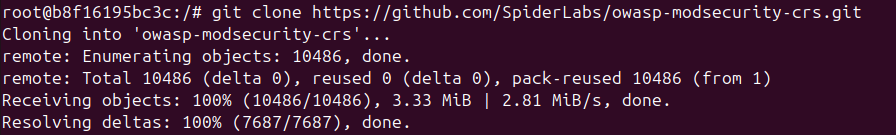
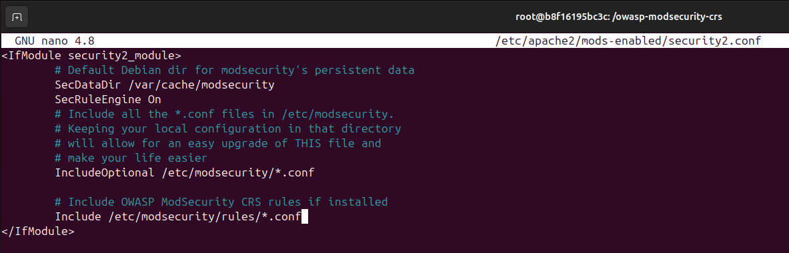
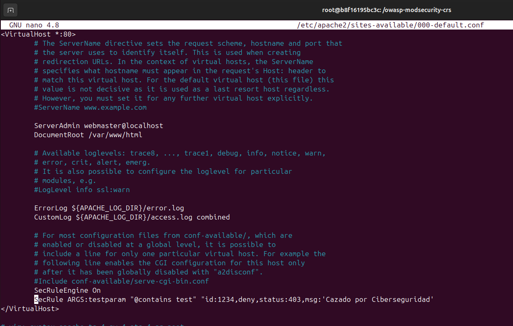
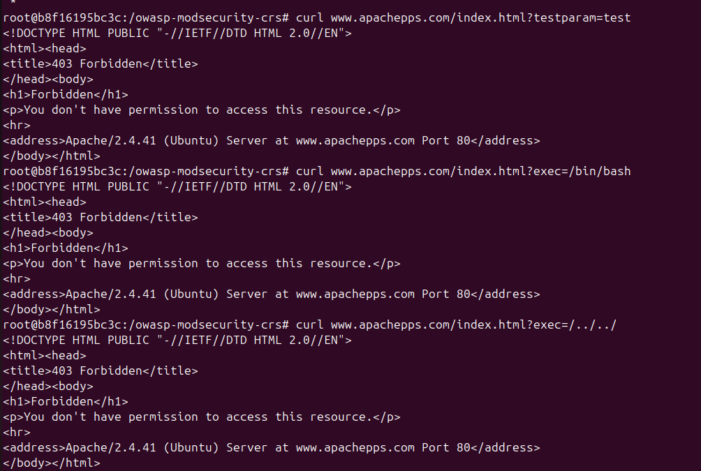
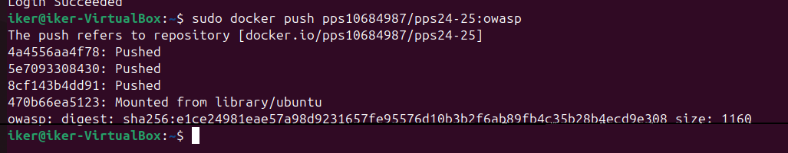

# 🔐 Hardening de Apache: Implementación de OWASP ModSecurity

## 📘 Descripción

En este apartado del proceso de hardening de Apache, implementaremos **ModSecurity** con el conjunto de reglas **OWASP Core Rule Set (CRS)**. Esta herramienta actúa como un **Web Application Firewall (WAF)**, permitiendo detectar y mitigar ataques web conocidos como **XSS**, **inyecciones SQL**, **CSRF**, entre otros. Es una de las medidas más recomendadas para reforzar la seguridad de servidores web Apache.

---

## 🧩 Introducción

**ModSecurity** es un módulo de seguridad que se integra con Apache para inspeccionar el tráfico HTTP y aplicar reglas personalizables que identifican y bloquean solicitudes potencialmente maliciosas.

El **OWASP Core Rule Set (CRS)** es un conjunto de reglas predefinidas desarrollado por OWASP, que ofrece una protección general y efectiva contra las vulnerabilidades más comunes en aplicaciones web, siguiendo el estándar del **Top 10 de OWASP**.

Este tipo de implementación es especialmente útil en servidores expuestos a internet, donde se requiere una defensa activa contra múltiples vectores de ataque.

---

## ⚙️ Requisitos Previos

- Tener instalado Docker.
- Crear un contenedor personalizado de Apache con **ModSecurity**.
- Descargar e integrar las reglas del **OWASP CRS**.

---

## 🛠️ Implementación

Desde el terminal donde Apache está corriendo dentro de un contenedor Docker:

### **1. Instalar OWASP CRS**

Instalamos la herramienta git y clonamos el repositorio de OWASP CRS:
```bash
apt install -y git
git clone https://github.com/SpiderLabs/owasp-modsecurity-crs.git
```


### **2. Configurar OWASP CRS en Apache**

Accedemos al repositorio clonado, copiamos la configuración y las reglas a la configuración de ModSecurity:
```bash
cd owasp-modsecurity-crs/
mv crs-setup.conf.example /etc/modsecurity/crs-setup.conf
mv rules/ /etc/modsecurity/
```

### **3. Configurar OWASP CRS en Apache**

Editamos la configuración de Apache para cargar OWASP CRS:
```bash
nano /etc/apache2/mods-enabled/security2.conf
```

Añadimos lo siguiente:
```apache
<IfModule security2_module>
    # Directorio para datos persistentes de ModSecurity
    SecDataDir /var/cache/modsecurity
    SecRuleEngine On
    # Cargar configuración de ModSecurity y OWASP CRS
    IncludeOptional /etc/modsecurity/*.conf
    Include /etc/modsecurity/rules/*.conf
</IfModule>
```
 

Guardamos y salimos.

### **4. ModSecurity con reglas personalizadas**

Editamos el archivo del VirtualHost para agregar una regla personalizada:
```bash
nano /etc/apache2/sites-available/000-default.conf
```
Añadimos la siguiente línea dentro de la configuración:
```bash
SecRuleEngine On
SecRule ARGS:testparam "@contains test" "id:1234,deny,status:403,msg:'Cazado por Ciberseguridad'
```


### **5. Reiniciamos Apache para aplicar los cambios**
```bash
service apache2 reload
```

## 🛠️ Verificación de ModSecurity y OWASP CRS

Para probar que ModSecurity y OWASP CRS están funcionando, realizamos pruebas con **ataques maliciosos simulados**:
```bash
curl www.apachepps.com/index.html?testparam=test
curl www.apachepps.com/index.html?exec=/bin/bash
curl www.apachepps.com/index.html?exec=/../../
```


## 📌 Imagen de Docker OWASP

Una vez configurado y probado nuestro servidor Apache con OWASP ModSecurity CRS, podemos guardar la imagen y subirla a Docker Hub para reutilizarla en otros entornos.
Primero, identificamos el ID del contenedor donde hemos configurado OWASP ModSecurity en Apache.
```bash
sudo docker ps
```
Hacemos un commit del contenedor en una nueva imagen.
```bash
sudo docker commit apache-container pps10684987/pps24-25:OWASP
```
  
Esta imagen podemos subirla a Docker Hub, para ello:
- Iniciamos sesión en Docker Hub:
```bash
sudo docker login
```
- Subimos la imagen:
```bash
sudo docker push pps10684987/pps24-25:OWASP
```

