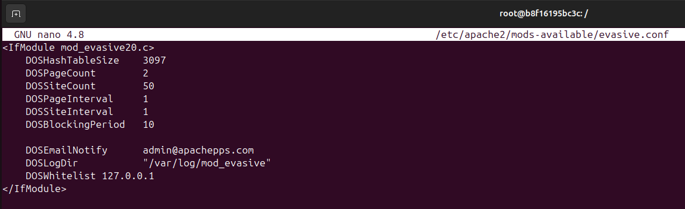
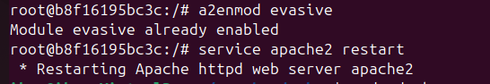
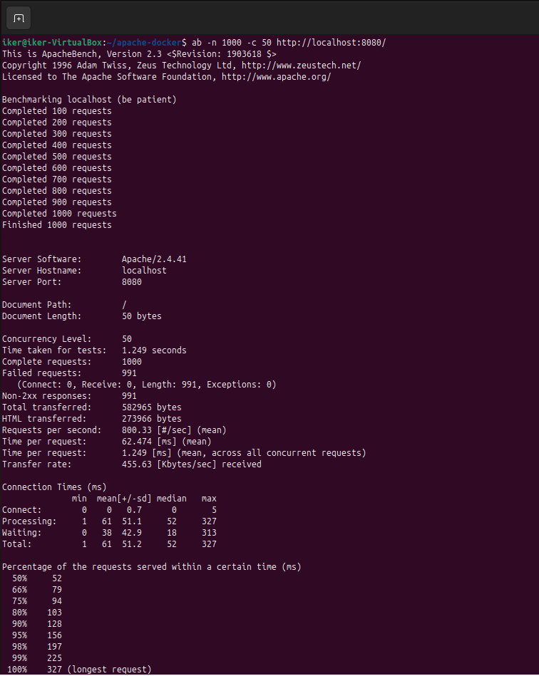
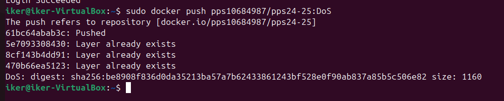

# 🛡️ Hardening de Apache: Prevención de ataques DDoS

## 📘 Descripción

En este apartado abordaremos técnicas para **prevenir ataques DDoS (Denegación de Servicio Distribuida)** en un servidor Apache. Este tipo de ataques consiste en saturar un servidor con múltiples solicitudes simultáneas, con el objetivo de consumir todos sus recursos y dejarlo inoperativo. Implementaremos configuraciones y herramientas que ayudan a mitigar este tipo de amenazas.

---

## 🧩 Introducción

Un **ataque DDoS** busca colapsar un servicio web enviando una cantidad masiva de tráfico malicioso desde múltiples orígenes. Apache, como servidor HTTP, puede ser un blanco fácil si no se toman medidas preventivas.

**Apache** provee el módulo **mod_evasive**, que detecta patrones de tráfico sospechoso y bloquea las direcciones IP que exceden ciertos umbrales de solicitudes en un período determinado.

Con esta configuración, mejoraremos la resiliencia de nuestro servidor contra este tipo de ataques.

---

## ⚙️ Requisitos Previos

- Docker instalado.
- Contenedor Apache en ejecución o preparado para configurarse.
- Acceso al contenedor para editar archivos de configuración de Apache o instalar módulos adicionales.

---

## 🔧 Mitigación DDoS

Accedemos al terminal del contenedor de Apache:

```bash
sudo docker exec -it apache-container/bin/bash
```

### **1. Instalar el módulo mod_evasive**

Durante la instalación de este módulo seguimos las indicaciones.  
```bash
apt install -y libapache2-mod-evasive
```

### **2. Configurar mod_evasive**

Editamos el archivo de configuración del módulo:
```bash
nano /etc/apache2/mods-available/evasive.conf
```

Añadimos la siguiente configuración:
```apache
<IfModule mod_evasive20.c>
    DOSHashTableSize 3097
    DOSPageCount 5
    DOSSiteCount 50
    DOSPageInterval 1
    DOSSiteInterval 1
    DOSBlockingPeriod 10

    DOSEmailNotify admin@apachepps.com
    DOSLogDir "/var/log/mod_evasive"
    DOSWhitelist 127.0.0.1
</IfModule>
```


### **3. Verificación del módulo evasive**

Primero, habilitamos el módulo evasive y reiniciamos el servicio Apache:
```bash
a2enmod evasive
service apache2 restart
```


Y Ejecutamos el siguiente comando para comprobar que mod_evasive está cargado:
```bash
apachectl -M | grep evasive
```


### **4. Crear el directorio de logs**

Para que mod_evasive registre los intentos de ataque, creamos y configuramos su directorio de logs:

```bash
mkdir -p /var/log/mod_evasive
chmod 777 /var/log/mod_evasive
```


## 🛠️ Verificación de Protección contra DoS con Apache Bench

Para comprobar que mod_evasive está funcionando correctamente, realizamos una prueba de carga con **Apache Bench**.

Ejecutamos la siguiente prueba de estrés, simulando múltiples solicitudes simultáneas:

```bash
ab -n 1000 -c 50 http://localhost:8080/
```

📌 **Explicación de los parámetros:**
- **`-n 1000`** → Número total de solicitudes a enviar.
- **`-c 50`** → Número de solicitudes concurrentes.

Si la configuración de mod_evasive es correcta, Apache empezará a rechazar solicitudes después de superar el umbral configurado, devolviendo errores **403 Forbidden**.  



## 📌 Imagen de Docker DDOS

Una vez configurado y probado nuestro servidor Apache con mod_evasive para mitigar ataques de Denegación de Servicio (DoS), podemos guardar la imagen y subirla a Docker Hub para reutilizarla.

Primero, identificamos el ID del contenedor donde hemos configurado Apache con mod_evasive:
```bash
sudo docker ps
```

Hacemos un commit del contenedor en una nueva imagen.
```bash
sudo docker commit apache-container pps10684987/pps24-25:DoS
```
  
Esta imagen podemos subirla a Docker Hub, para ello:
- Iniciamos sesión en Docker Hub:
```bash
sudo docker login
```
- Subimos la imagen:
```bash
sudo docker push pps10684987/pps24-25:DoS
```

