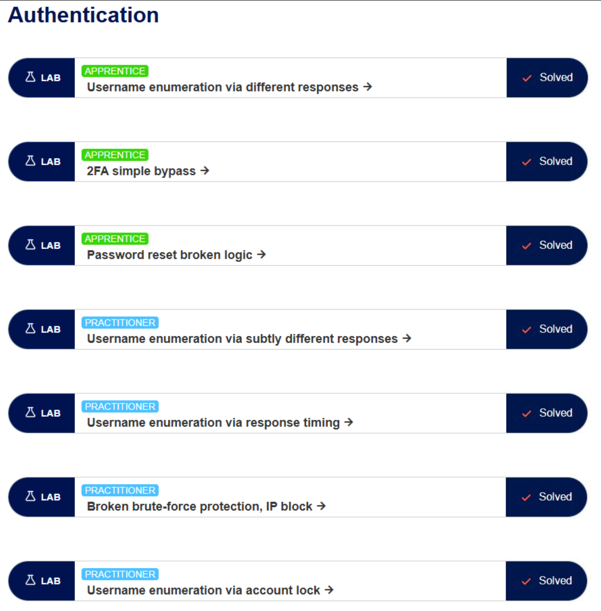
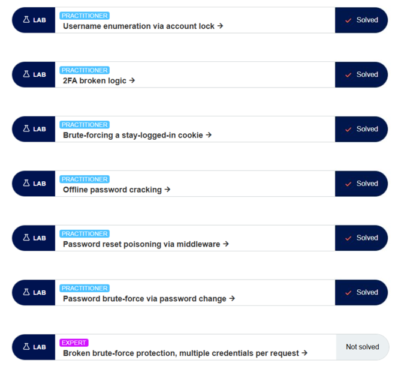
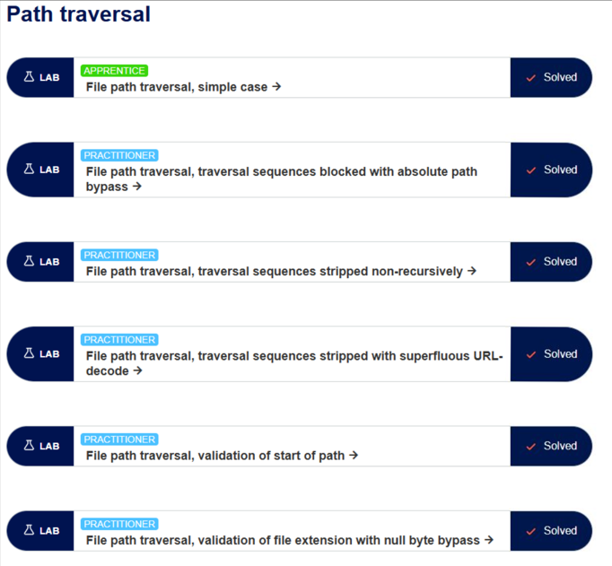
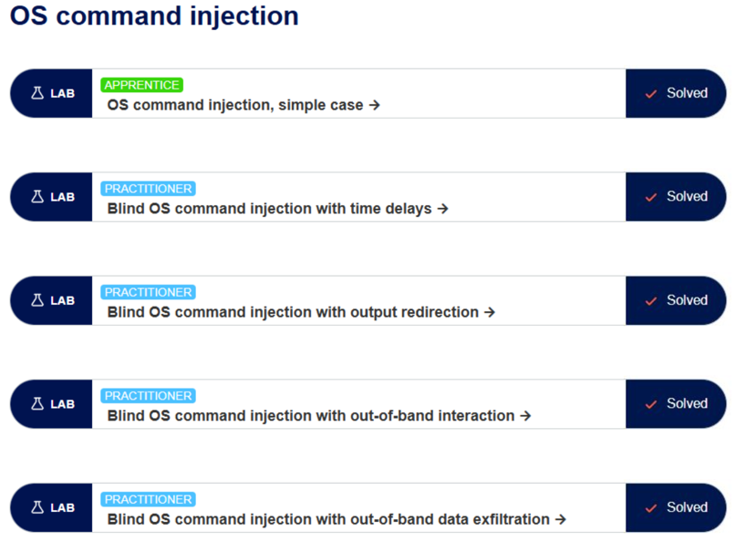
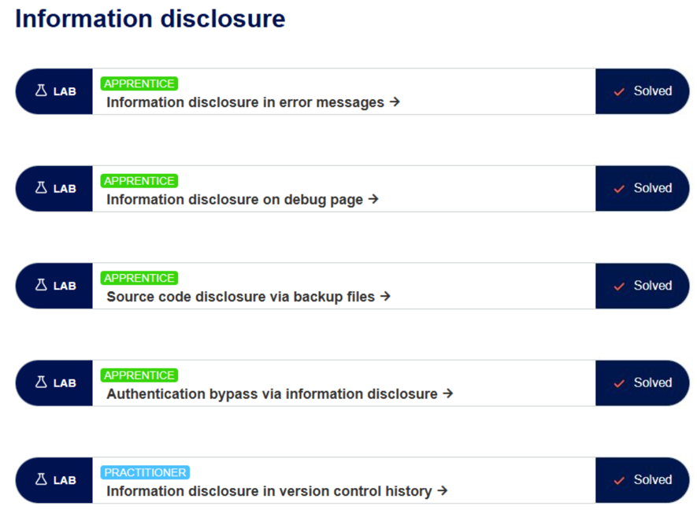
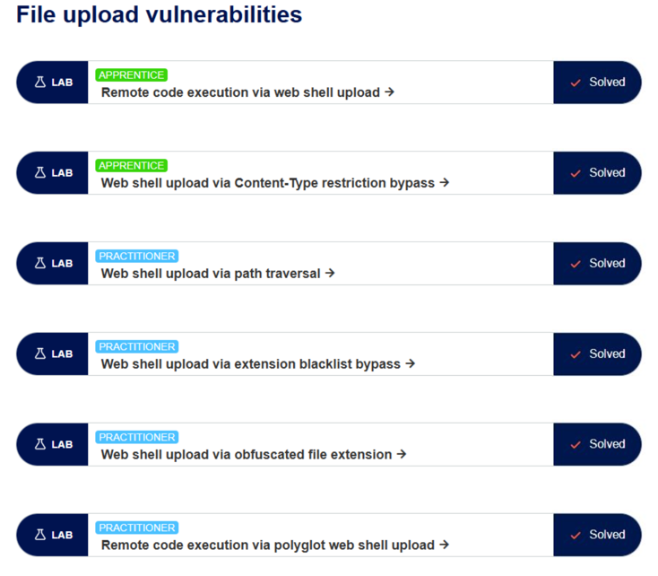
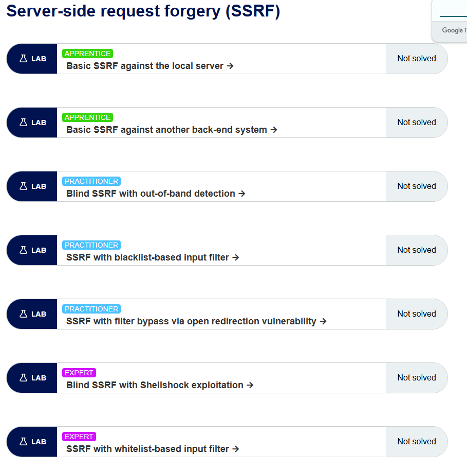
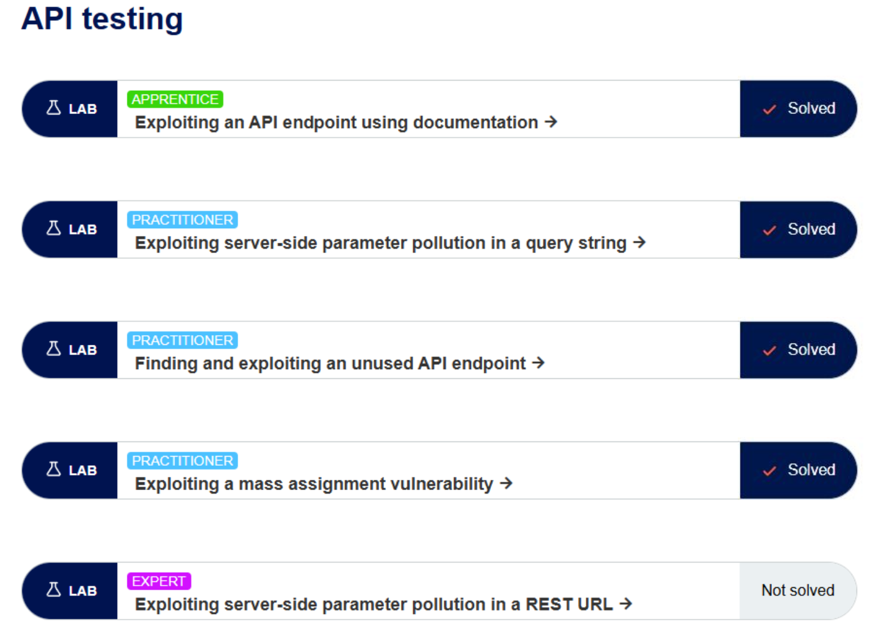
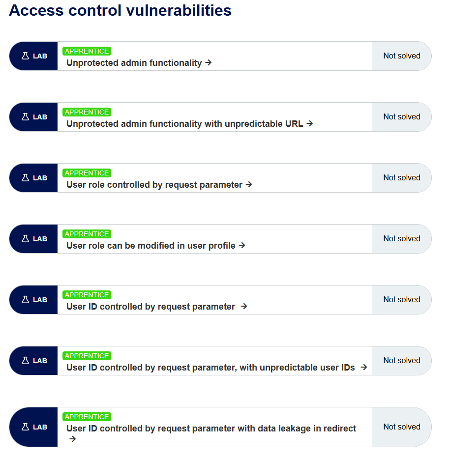
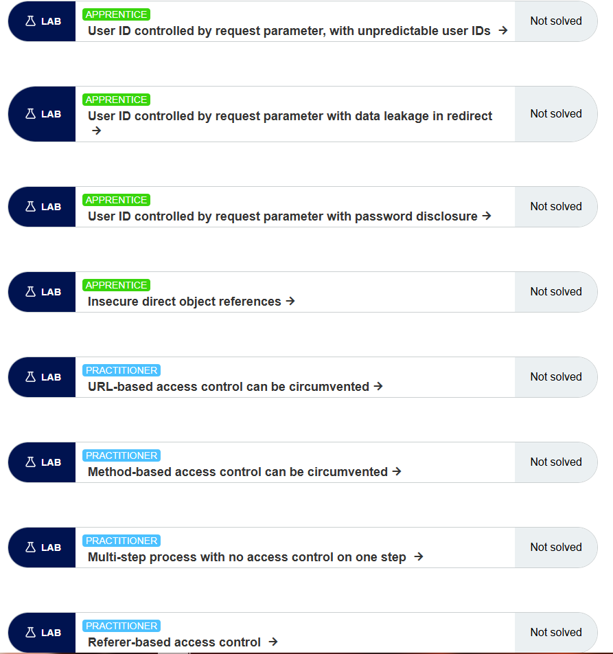

# RA 4.1

Aquí te dejo las capturas de los distintos laboratorios que solicita la tarea.  
He completado casi todos los apartados. Las capturas están en el siguiente orden:

1. Authentication  
2. Path Traversal  
3. OS Command Injection  
4. Information Disclosure  
5. File Upload  
6. SSRF  
7. API Testing
8. Access Control

1. 
1. 
2. 
3. 
4. 
5. 
6. 
7. 
8. 
8. 
