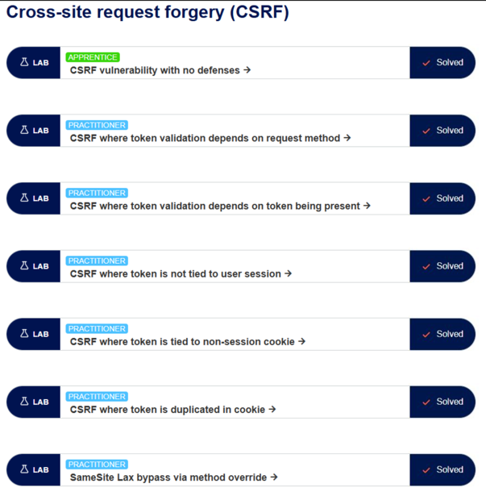
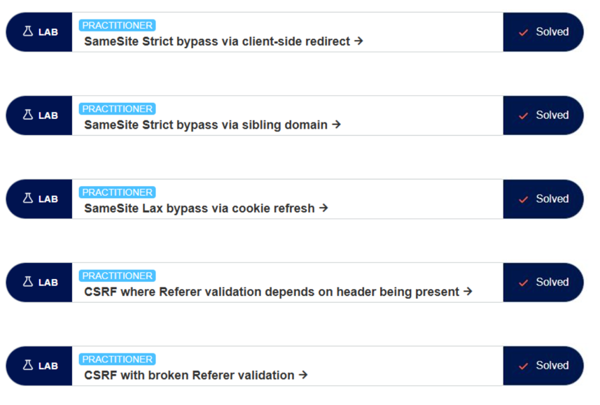
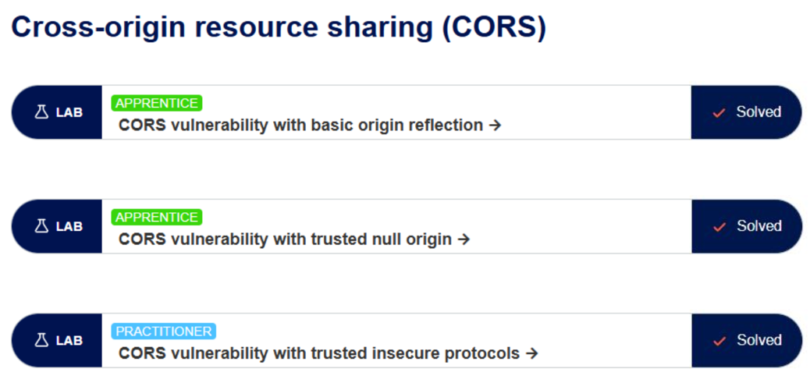
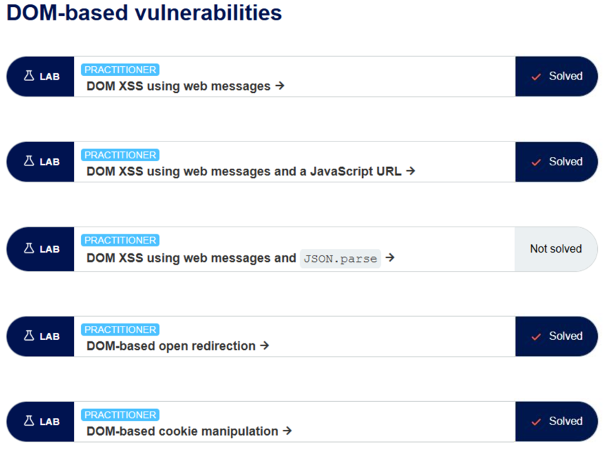
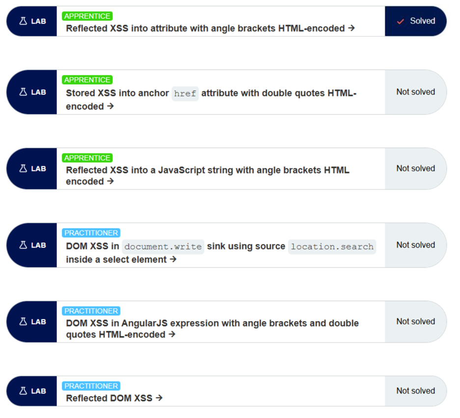

# RA 4.2 Burp Suite - Client Side

Aquí te dejo las capturas de los distintos laboratorios que solicita la tarea. He completado casi todos los apartados. Las capturas están en el siguiente orden:

1. CSRF  
2. CORS  
3. DOM  
4. XSS

