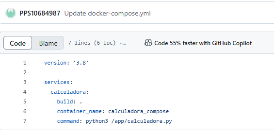
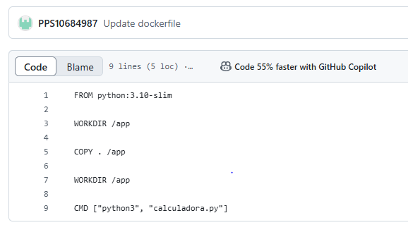
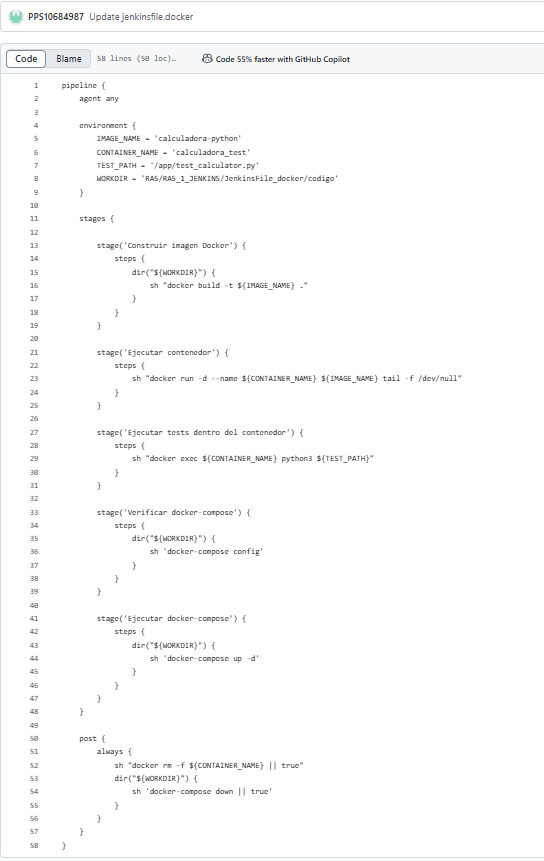
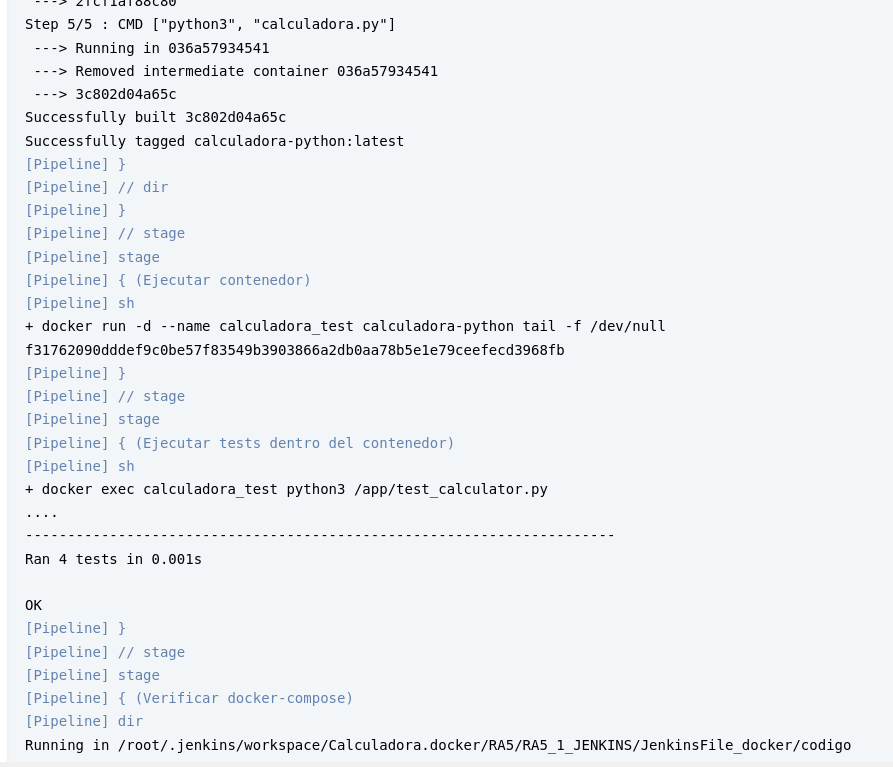
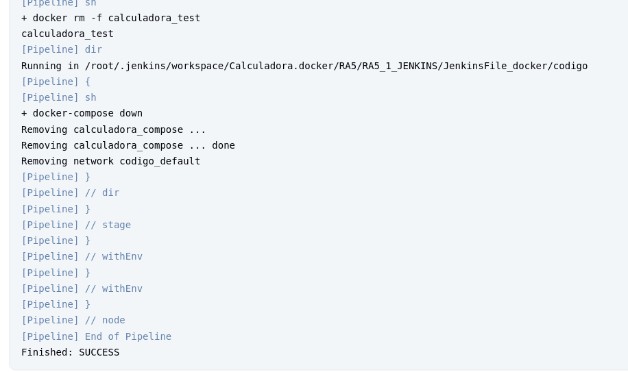
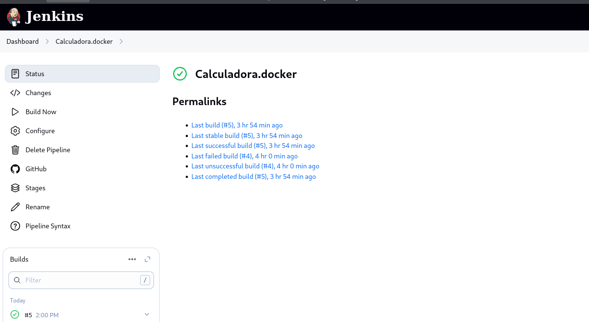
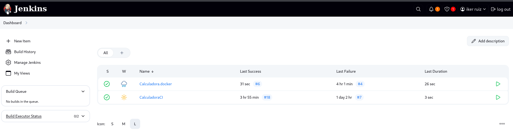

# RA5.1 - Integración de Jenkins con Docker

## Descripción de la tarea

En esta tarea hemos aprendido a integrar **Jenkins** con **Docker** para automatizar el proceso de construcción, despliegue y prueba de un test de calculo simple escrito en Python.

El objetivo era crear una pipeline en Jenkins que construyera una imagen Docker a partir del código fuente, ejecutara un contenedor con esa imagen y luego ejecutara los tests dentro del contenedor.

---
## Estructura del proyecto

La estructura de carpetas relevante del repositorio es la siguiente:

- `calculadora.py`: archivo con el código fuente de la calculadora.
- `test_calculator.py`: archivo con las pruebas unitarias.
- `Dockerfile`: archivo que define cómo construir la imagen Docker.
- `jenkinsfile.docker`: define la pipeline de Jenkins.





---

## Jenkinsfile - Pipeline 

El archivo `jenkinsfile.docker` contiene una pipeline de Jenkins que sigue estos pasos:

1. **Checkout del repositorio** desde GitHub.
2. **Construcción de la imagen Docker** usando el `Dockerfile`.
3. **Ejecución del contenedor** desde la imagen construida.
4. **Ejecución de las pruebas** unitarias dentro del contenedor.
5. **Verificación de Docker Compose**.
6. **Eliminación del contenedor** al finalizar.

### Fragmentos clave de la pipeline

```groovy
// Construcción de la imagen
docker build -t calculadora-python .

// Ejecución del contenedor
docker run -d --name calculadora_test calculadora-python tail -f /dev/null

// Ejecución de pruebas
docker exec calculadora_test python3 /app/test_calculator.py

// Eliminación del contenedor
docker rm -f calculadora_test

// Parada de servicios con docker-compose (si existe)
docker-compose down



# Resultado:

### Resultado de la ejecución

Aunque en algunas ejecuciones se mostraron errores menores (como rutas incorrectas o ausencia de `docker-compose`), el **resultado final fue exitoso**, ya que:

- La imagen Docker se construyó correctamente.
- El contenedor se lanzó con éxito.
- Jenkins fue capaz de ejecutar comandos dentro del contenedor.
- El flujo de CI/CD quedó completamente automatizado.

Esto demuestra que Jenkins está correctamente integrado con Docker y puede utilizarse para gestionar pipelines de integración continua basadas en contenedores.






