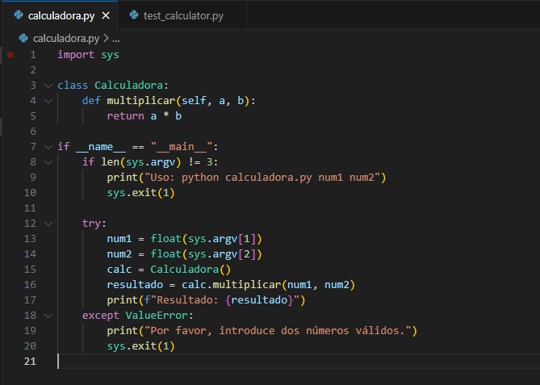
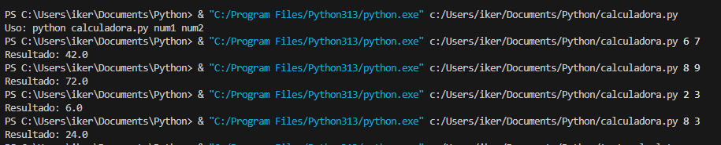
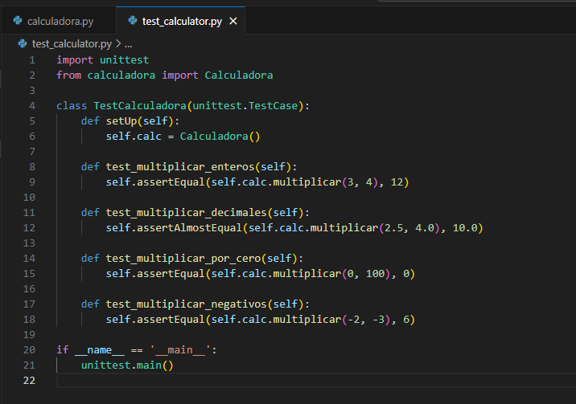

# Calculadora con Pruebas Unitarias en Python

## Descripción

Este proyecto es una calculadora muy sencilla en Python que permite multiplicar dos números desde la línea de comandos.

---

## ¿Por qué debemos separar el código en dos archivos?

- **'calculadora.py'**: Contiene la clase 'Calculadora' con el método 'multiplicar()', y además permite ejecutar el programa desde la línea de comandos para ver el resultado de una multiplicación.
- **'test_calculator.py'**: Contiene las pruebas automáticas que validan si la función de multiplicar está funcionando bien. 

Separar el código de la lógica de las pruebas hace que sea más fácil de mantener, probar y reutilizar.

## ¿Cómo funciona el código?

### 'calculadora.py'

1. Se define una **clase** llamada `Calculadora` con un método `multiplicar()` que toma dos parámetros y devuelve su producto.
2. Si se ejecuta el archivo directamente (no importado), el programa:
   - Lee dos números desde la línea de comandos.
   - Los convierte a `float`.
   - Llama al método `multiplicar()` de la clase.
   - Imprime el resultado.

Ejemplo de ejecución:

### 'test_calculator.py'

Utiliza la librería unittest para comprobar diferentes casos:

- Multiplicación de enteros.

- Multiplicación de decimales.

- Multiplicación por cero.

- Multiplicación de números negativos.

Esto asegura que el método funcione correctamente en distintas situaciones.

Para ejecutar las pruebas: python -m unittest test_calculator.py

