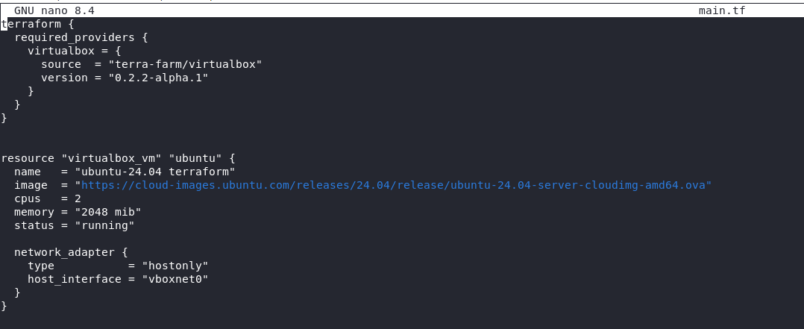
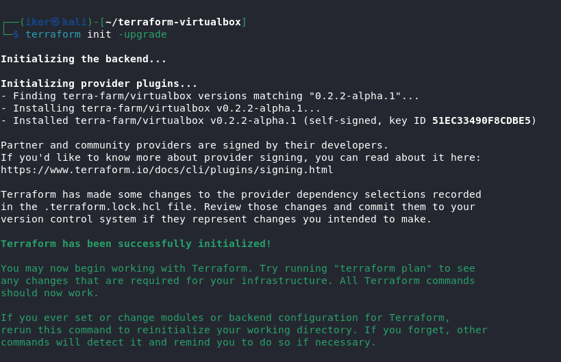
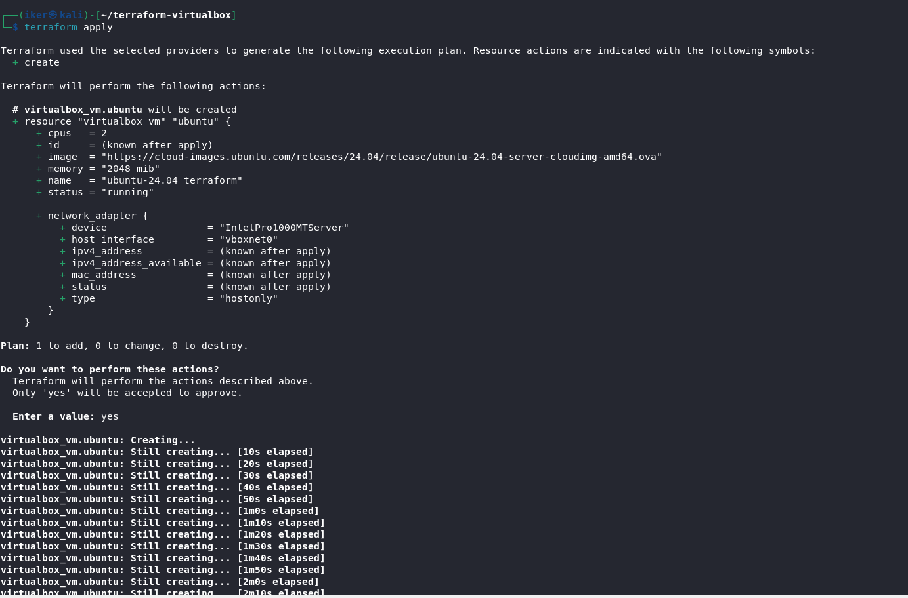
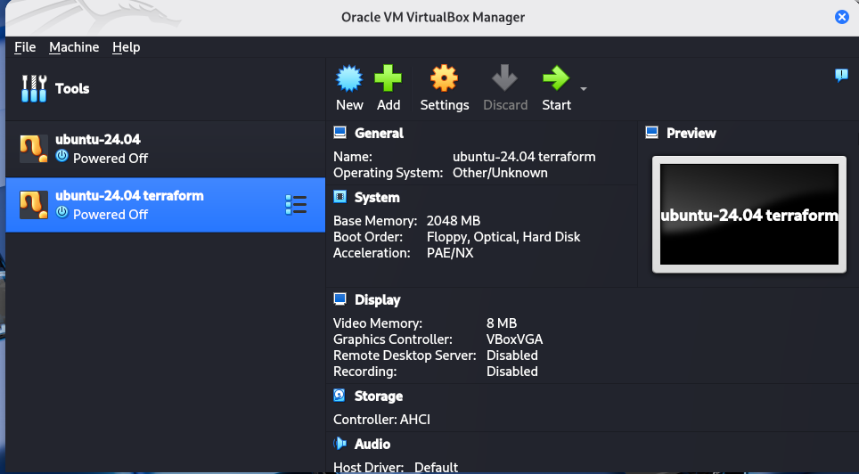

<<<<<<< HEAD:RA5/RA5_2/README_Terraform.md
# Provisionamiento de una Máquina Virtual Ubuntu 24.04 en VirtualBox usando Terraform

Esta práctica muestra cómo utilizar Terraform para crear una máquina virtual de Ubuntu 24.04 en VirtualBox.

## Requisitos

Antes de comenzar, nos aseguraremos de tener instalado lo siguiente:

- VirtualBox
- Terraform
- Un archivo `.vdi` o `ova` válida de VirtualBox.

## Instalación del Provider VirtualBox para Terraform

Terraform no tiene un proveedor oficial de VirtualBox en su registro, por lo tantoutilizaremos el provider terra-form-provider-virtualbox. El repositorio terra-farm/terraform-provider-virtualbox es un proveedor no oficial de Terraform que permite interactuar con VirtualBox usando archivos .vdi para crear, configurar y administrar máquinas virtuales desde código.

1. Clonamos el repositorio oficial del provider:

    ```bash
    git clone https://github.com/terra-farm/terraform-provider-virtualbox.git
    cd terraform-provider-virtualbox
    ```

2. Creamos un directroio para Terraform y los archivos necesarios para la creación de la MV en terraform (main.tf):

    ```bash
    mkdir terraform-virtualbox
    nano main.tf
    ```
A continuación, dentro del archivo main.tf añadimos la definición de la máquina virtual a provisionar. Este archivo incluye el nombre de la VM, la cantidad de CPU, memoria, el adaptador de red y la ruta al archivo (image) `.vdi` u `ova`.
Además, deberemos especificar el provider que hemos clonado.

3. Actualización e Inicio de Terraform:

Para implementar correctamente el provider dberemos ejecutar el init de Terraform añadiendo el parametro "-upgrade". Así, lograremos installar el provider y se iniciara correctamente.

    ```bash
       terraform init -upgrade
    ```
!(captura)[images_terraform/Captura13.PNG]

## Ejecución del main.tf en Terraform

Al crear el archivo `main.tf` con la definición de la máquina virtual a provisionar e iniciar Terraform correctamente, ya podremos aplicar la configuración de la MV. Para ello, ejecutaremos "terraform apply" Terraform mostrará un resumen de los cambios que realizará. Escribimos yes para confirmar y proceder con la creación de la máquina virtual.
Finalmente, al finalizar la ejecución del terraform, nos dirigiremos a virtualbox y podremos observar que efectivamente se ha creado la MV en virtualbox mediante Terraform. Aunque tiene algún que otro error de reación, ya que me ha creado la MV pero sin ningún adaptador de red y tampoco con ningún disco. Este problema, no lo he conseguido solucionar.

=======
# Provisionamiento de una Máquina Virtual Ubuntu 24.04 en VirtualBox usando Terraform

Esta práctica muestra cómo utilizar Terraform para crear una máquina virtual de Ubuntu 24.04 en VirtualBox.

## Requisitos

Antes de comenzar, nos aseguraremos de tener instalado lo siguiente:

- VirtualBox
- Terraform
- Un archivo `.vdi` o `ova` válida de VirtualBox.

## Instalación del Provider VirtualBox para Terraform

Terraform no tiene un proveedor oficial de VirtualBox en su registro, por lo tantoutilizaremos el provider terra-form-provider-virtualbox. El repositorio terra-farm/terraform-provider-virtualbox es un proveedor no oficial de Terraform que permite interactuar con VirtualBox usando archivos .vdi para crear, configurar y administrar máquinas virtuales desde código.

1. Clonamos el repositorio oficial del provider:

    ```bash
    git clone https://github.com/terra-farm/terraform-provider-virtualbox.git
    ```


2. Creamos un directroio para Terraform y los archivos necesarios para la creación de la MV en terraform (main.tf):

    ```bash
    mkdir terraform-virtualbox
    nano main.tf
    ```


A continuación, dentro del archivo main.tf añadimos la definición de la máquina virtual a provisionar. Este archivo incluye el nombre de la VM, la cantidad de CPU, memoria, el adaptador de red y la ruta al archivo (image) `.vdi` u `ova`.
Además, deberemos especificar el provider que hemos clonado.



3. Actualización e Inicio de Terraform:

Para implementar correctamente el provider dberemos ejecutar el init de Terraform añadiendo el parametro "-upgrade". Así, lograremos installar el provider y se iniciara correctamente.

    ```bash
       terraform init -upgrade
    ```


## Ejecución del main.tf en Terraform

Al crear el archivo `main.tf` con la definición de la máquina virtual a provisionar e iniciar Terraform correctamente, ya podremos aplicar la configuración de la MV. Para ello, ejecutaremos "terraform apply" Terraform mostrará un resumen de los cambios que realizará. Escribimos yes para confirmar y proceder con la creación de la máquina virtual.
Finalmente, al finalizar la ejecución del terraform, nos dirigiremos a virtualbox y podremos observar que efectivamente se ha creado la MV en virtualbox mediante Terraform. Aunque tiene algún que otro error de reación, ya que me ha creado la MV pero sin ningún adaptador de red y tampoco con ningún disco. Este problema, no lo he conseguido solucionar.



>>>>>>> 6c0ab4b1bd79d16ff1d0584bd2ca7885dd1d1100:RA5/RA5_2/README.md
