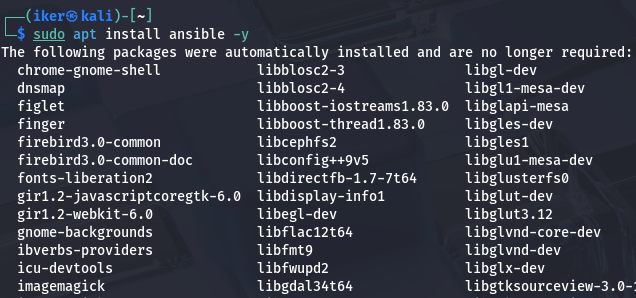
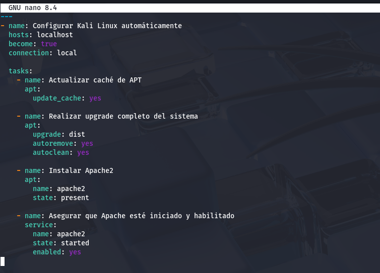
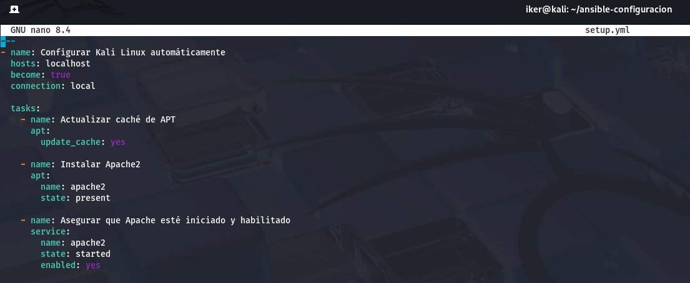
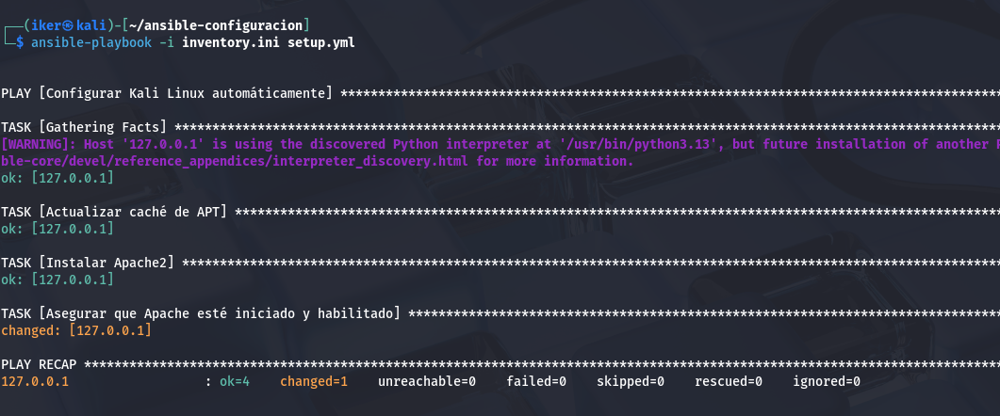
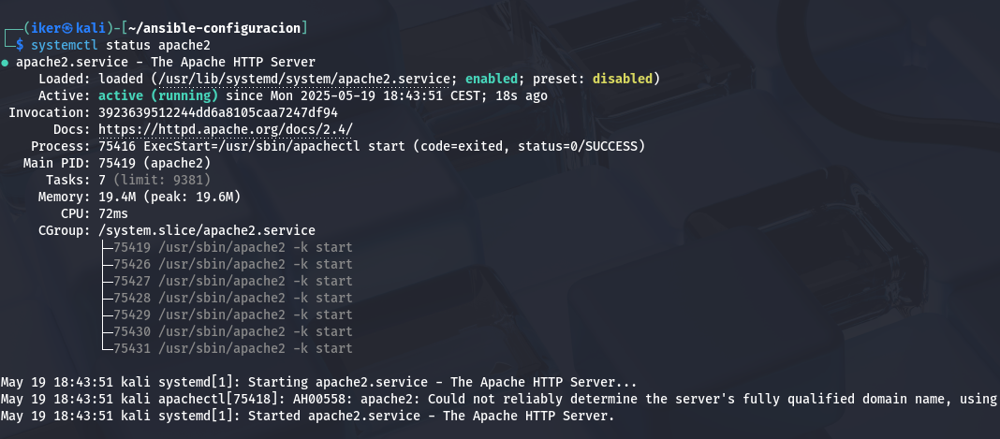

# Automatización de configuración local con Ansible en Kali Linux

Este documento describe los pasos realizados desde una máquina **Kali Linux** para cumplir con los objetivos propuestos en las actividades **3.2** y **3.3**, usando **Ansible** para automatizar la instalación de servicios, la actualización del sistema, la configuración del servidor web Apache y la verificación de su funcionamiento mediante `curl`.
Ya que el uso de Terraform en la creación de una MV Ubuntu 24.04 no ha sido exitoso, configuro Ansible de manera local para automatizar las acciones requeridas por la práctica ya que es el mismo procedimiento que con una MV remota, excepto la conexión mediante SSH.

---

## Requisitos previos.

- Deberemos tener instalado Ansible.

## 3.2. Configurar una máquina virtual en Virtualbox mediante Ansible.

En esta parte de la Práctica usamos Ansible **desde la propia máquina Kali Linux** para configurar el sistema local. Para ello, creamos un archivo de inventario apuntando a `127.0.0.1`, y un playbook con los siguientes pasos:

1. **Actualizar la caché de paquetes del sistema**:  
   Se usó el módulo `apt` para ejecutar `apt update` de forma automática, asegurando que la lista de paquetes estuviera al día.

2. **Realizar upgrade completo del sistema**:  
   Se utilizó el parámetro `upgrade: dist`. Esta configuración permite actualizar el sistema automaticamente.

3. **Instalar el servicio Apache**:  
   Se instaló el paquete `apache2` mediante Ansible y nos aseguramos que el servicio estuviera activo y habilitado con `systemctl`.

Al realizar este proceso surgio un problema con el upgrade. Ya que al iniciar el playbook con el upgrade configurado, nunca lograba completar el upgrade. Por lo tanto, al eliminar el apartado de upgrade del playbook, conseguimos que la ejecución fuese exitosa y completara todo el resto del playbook.

Al quitar el apartado del upgrade del playbook:

Correcta instalación de Apche2:

---

## 3.3. Configuración del contenido web y verificación con Ansible

En la segunda parte de la actividad se implementaron tareas adicionales para crear contenido web básico y verificarlo automáticamente:

1. **Crear un archivo `index.html` personalizado**:  
   Se utilizó el módulo `copy` para crear el archivo `/var/www/html/index.html` con el contenido `Ansible rocks`, asignando los permisos correctos y asegurando que el servidor pudiera servirlo.

2. **Reiniciar el servicio Apache**:  
   Luego de crear el archivo, se reinició el servicio `apache2` con Ansible para que los cambios fueran aplicados correctamente.

3. **Realizar un `curl` local y verificar el contenido**:  
   Se ejecutó `curl http://localhost` mediante el módulo `command`, y el resultado se almacenó con `register`. Finalmente, se usó el módulo `assert` para verificar que el contenido de la respuesta incluía el texto `Ansible rocks`.

---

## Resultado Final

El playbook se ejecutó correctamente, aplicando cada paso sin errores:

- El sistema se actualizó automáticamente.
- Apache fue instalado y reiniciado correctamente.
- El archivo `index.html` fue creado exitosamente.
- El contenido del servidor fue verificado mediante `curl
