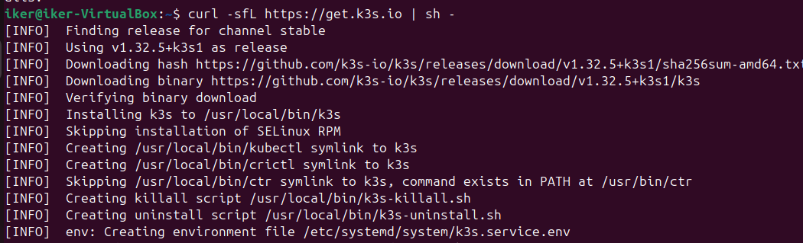
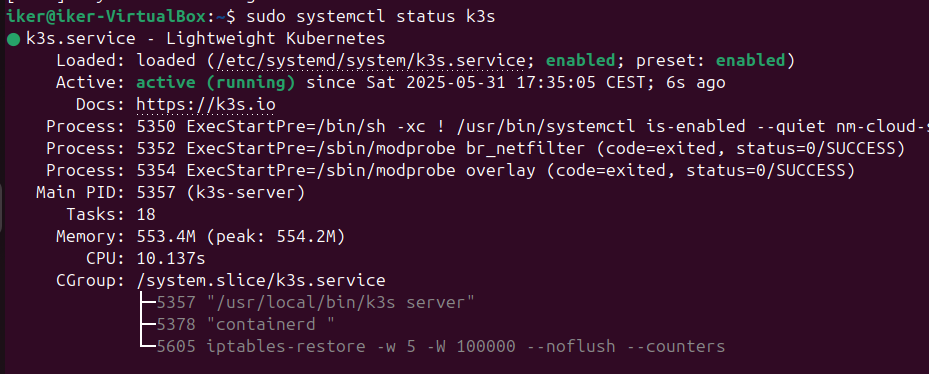
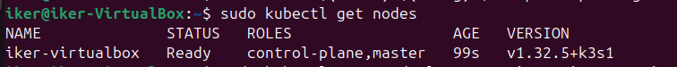
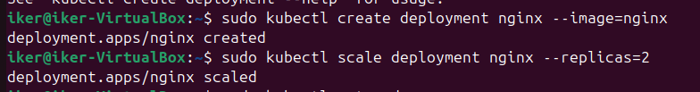
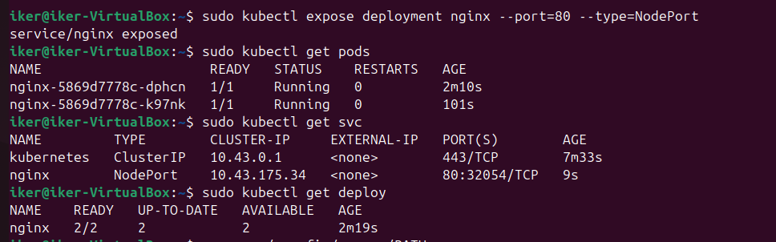
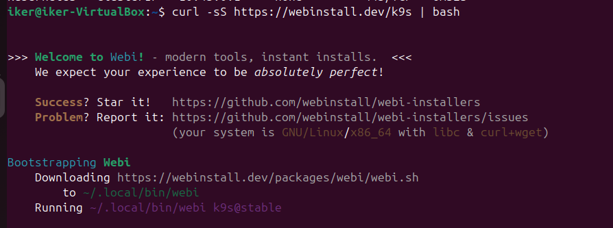
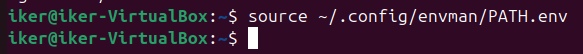
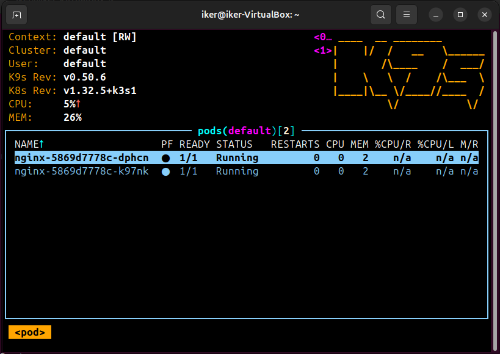

# RA5_3_1 - Instalación de K3s en modo Single-Node y despliegue de NGINX

## 📌 Introducción

En esta actividad se realizará la instalación, configuración y validación de un clúster **K3s** en modo **single-node**. Posteriormente, se desplegará un servicio **NGINX** con 2 réplicas. Además, se instalará y configurará **K9s**, una herramienta de visualización de clústeres de Kubernetes, para validar el correcto funcionamiento del entorno.

---

##  Requisitos Previos

Antes de comenzar, asegúrate de contar con lo siguiente:

- Una máquina virtual o física con sistema operativo Linux (Ubuntu 20.04 o superior)
- Acceso con privilegios de superusuario (root o sudo)
- Acceso a internet para descarga de paquetes.
- `curl` y `kubectl` instalados.

---

## 🛠️ Pasos para la instalación y despliegue

### 1. Instalación de K3s en modo Single-Node
Esto instalará K3s y creará el archivo de configuración en `/etc/rancher/k3s/k3s.yaml`
```bash
curl -sfL https://get.k3s.io | sh -
```


### Verificar estado del servicio:
```bash
sudo systemctl status k3s
```


### Configurar kubectl

```bash
mkdir -p $HOME/.kube
sudo cp /etc/rancher/k3s/k3s.yaml $HOME/.kube/config
sudo chown $(id -u):$(id -g) $HOME/.kube/config
```


### Verificar conexión:
```bash
sudo kubectl get nodes
```


### Desplegar servicio NGINX con 2 réplicas

```bash
sudo kubectl create deployment nginx --image=nginx
sudo kubectl scale deployment nginx --replicas=2
```


### Deberemos exponer el servicio:
```bash
sudo kubectl expose deployment nginx --port=80 --type=NodePort
```

### Verificar:
```bash
sudo kubectl get pods
sudo kubectl get svc
sudo kubectl get deploy
```


---

## Instalar K9s

```bash
curl -sS https://webinstall.dev/k9s | bash
```


### Activar ruta si no reconoce el comando:
```bash
source ~/.config/envman/PATH.env
```


### Ejecutar:
```bash
k9s
```
Al finalizar la actividad y acceder a K9s, podremos observar que el clúster K3s en modo single-node está funcionando correctamente. En la pantalla principal se mostrarán los pods del clúster, donde aparecen dos instancias del deployment de Nginx, ambas con estado Running, sin reinicios y completamente listas (1/1). Esto indica que las dos réplicas se han desplegado correctamente.



## ✅ Conclusión

En esta primera tarea se ha logrado desplegar exitosamente un clúster K3s en modo single-node, una solución ligera y eficiente para entornos de desarrollo o pruebas. A través del despliegue de un servicio Nginx con 2 réplicas, se ha comprobado la capacidad de Kubernetes para gestionar la alta disponibilidad incluso en un nodo único. Además, mediante la instalación y uso de K9s, se ha podido validar visualmente el estado de los recursos del clúster, facilitando la supervisión y el control de los pods, deployments y servicios.
