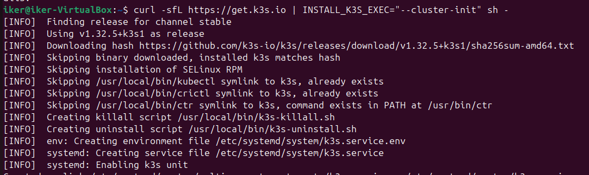
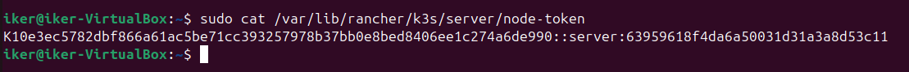
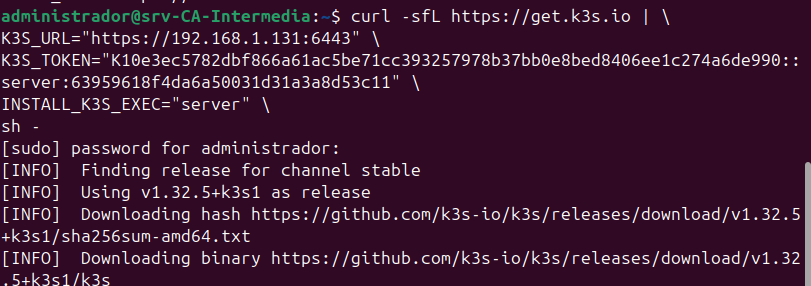
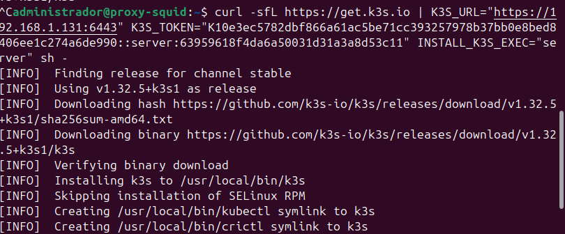
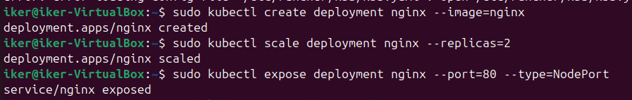
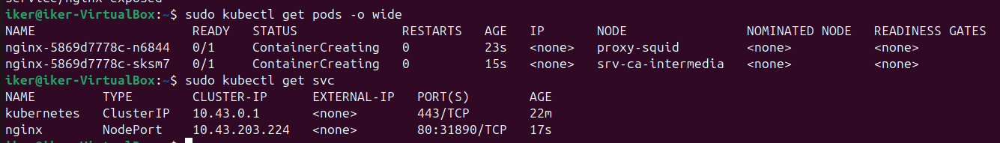
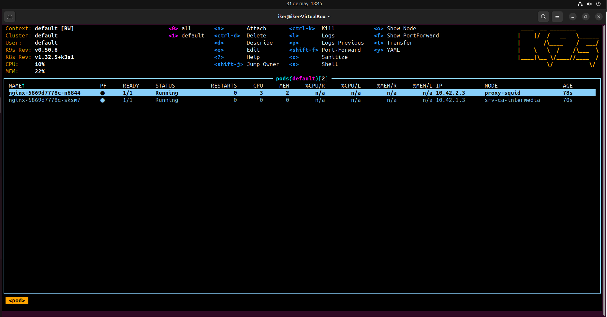

# RA_5_2 - Instalación de K3s en modo High Availability (HA) y despliegue de Nginx

## Introducción

En esta tarea se realiza la instalación y configuración de un clúster **K3s en modo HA (High Availability)**, utilizando múltiples nodos para garantizar la tolerancia a fallos y la alta disponibilidad del sistema. Posteriormente, se desplegará un servicio Nginx con 2 réplicas y se utilizará **K9s** para validar y gestionar el estado del clúster y los recursos.

## Requisitos Previos

Para poder llevar a cabo esta actividad, se requiere:

- Al menos **3 máquinas virtuales o físicas**.
- Sistema operativo Linux en todos los nodos.
- Acceso `sudo` en cada máquina
- Conexión de red entre los nodos
- Herramientas instaladas:
  - `curl`
  - `kubectl`
  - `k9s`
  - `openssh` habilitado entre nodos
- Los 3 equipos en este caso:
  - Equipo 1: Ubuntu Desktop 20.04 con ip '192.168.1.131' 
  - Equipo 2: Ubuntu Server con ip '192.168.1.134'
  - Equipo 3: Ubuntu Server con ip '192.168.1.135'

## 🛠️ Pasos para la instalación y despliegue.

### Configurar los nodos

En todos los nodos deberemos actualizar el sistema:
```bash
sudo apt update && sudo apt upgrade -y
```

### Instalar K3s en modo HA en el nodo principal (Ubuntu Desktop 20.04).
Este nodo inicia el clúster con etcd embebido.
```bash
curl -sfL https://get.k3s.io | INSTALL_K3S_EXEC="server --cluster-init" sh -
```


A continuación, obtendremos el token, necesario para la configuración en el resto de nodos.
```bash
sudo cat /var/lib/rancher/k3s/server/node-token
```


# Añadir el resto de nodos al plano de control.

### En los demás nodos ejecutaremos:

 

## Verificar estado del clúster

En el nodo principal:
```bash
sudo kubectl get nodes
```


## Desplegar servicio NGINX 

### Ejecutar en el nodo principal: 
```bash
kubectl create deployment nginx --image=nginx
kubectl scale deployment nginx --replicas=2
kubectl expose deployment nginx --port=80 --type=NodePort
```


### Verificamos el estado:
```bash
sudo kubectl get pods -o wide
sudo kubectl get svc
```


### K9s y su ejecución:
Al acceder a K9s tras haber instalado el clúster K3s en modo High Availability (HA) y desplegado el servicio Nginx, podremos observar un entorno distribuido y más robusto. En la interfaz principal de K9s, se observan los nodos registrados en el clúster, todos en estado Ready, lo que indica que la configuración HA ha sido exitosa y que el clúster reconoce correctamente todos los servidores y agentes.

Al inspeccionar los pods, podemos observar que las 2 réplicas de Nginx se encuentran en estado Running y distribuidas entre distintos nodos del clúster, lo que demuestra la capacidad de Kubernetes para balancear cargas y garantizar disponibilidad incluso si uno de los nodos falla.


## ✅ Conclusión
En esta segunda tarea se ha conseguido desplegar un clúster K3s en modo High Availability (HA), demostrando cómo se puede lograr un entorno de Kubernetes resiliente y distribuido con múltiples nodos. La correcta configuración y sincronización entre los servidores y agentes han permitido establecer un clúster capaz de tolerar fallos y mantener la continuidad del servicio.

El despliegue del servicio Nginx con 2 réplicas ha servido como prueba funcional para validar la operación del clúster, mostrando cómo Kubernetes distribuye las cargas entre nodos y garantiza que las aplicaciones sigan disponibles incluso si un nodo deja de estar operativo.
