# RA5_3_3 - Despliegue de un Docker Compose en K3s y validación con K9s

## Introducción

En esta actividad se pretendía desplegar una aplicación definida en un archivo `docker-compose.yml` dentro de un clúster Kubernetes utilizando **K3s**, y posteriormente validar su estado mediante la herramienta **K9s**. Sin embargo, durante el desarrollo de la tarea no fue posible llevar a cabo la conversión ni el despliegue correcto en el entorno K3s, por lo que se ha ejecutado el `docker-compose.yml` directamente con **Docker** como alternativa funcional para validar el comportamiento de la aplicación.

## Requisitos Previos

Para realizar la tarea de forma alternativa se requiere:

- Tener **Docker** instalado y en ejecución
- Disponer de un archivo válido `docker-compose.yml`
- Acceso a terminal con permisos `sudo`

## 🛠️ Pasos para la instalación y despliegue.

### Preparar entorno y estructura de archivos.

Crearemos un directorio nombrado como Hello-world. Y deberá disponer de la siguiente distribución de archivos.
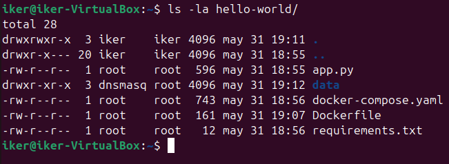

Los archivos que contendrá el directorio, deberán tener el siguiente contenido:

### app.py
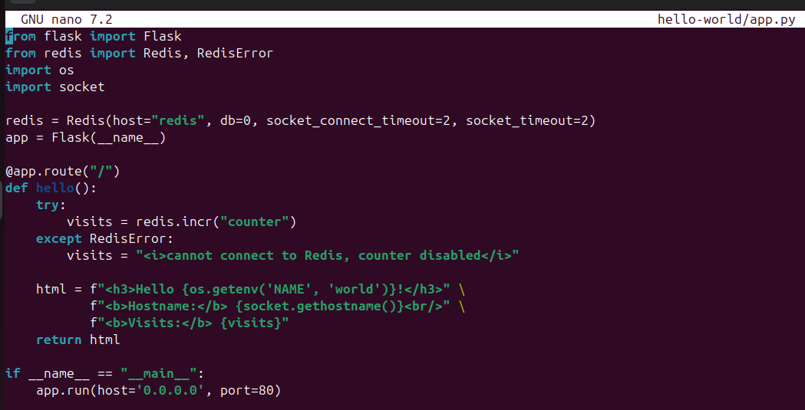

### Dockerfile
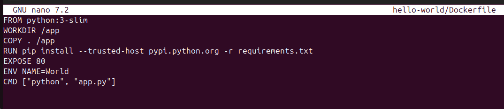

### requirements.txt
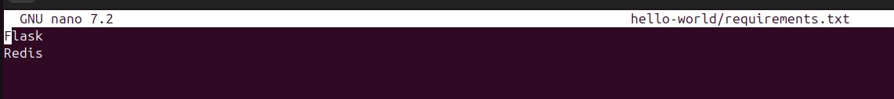

### docker-compose.yaml
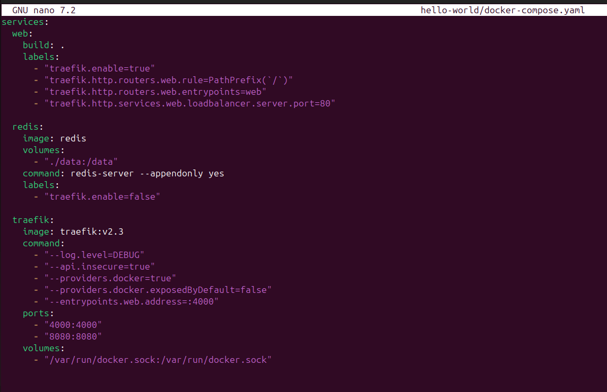

Actualizamos e instalamos lo necesario:
```bash
sudo apt update
sudo apt install docker
sudo apt install docker.io
sudo apt install docker compose
```
---

## Construir imagen y probar aplicación.

### Construcción manual:
```bash
sudo docker build -t helloworld .
```


### Ejecución directa para pruebas:
```bash
sudo docker run --rm -p 4000:80 helloworld
```
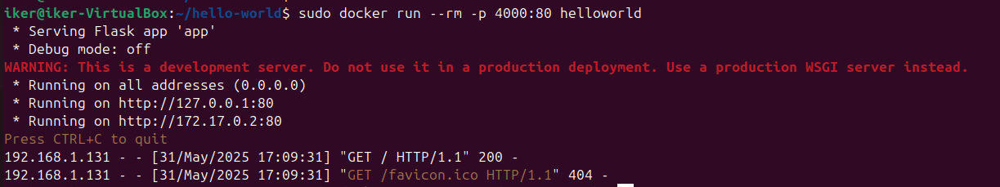

Para comprobar si el arranque ha sido exitoso, nos dirigiremos a nuestro navegador y buscaremos "http://192.168.1.131:4000"
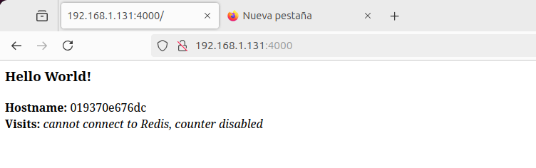

## Despliegue con `docker-compose`

### Ejecutamos el despliegue con balanceo:
```bash
sudo docker-compose up -d --scale web=5
```
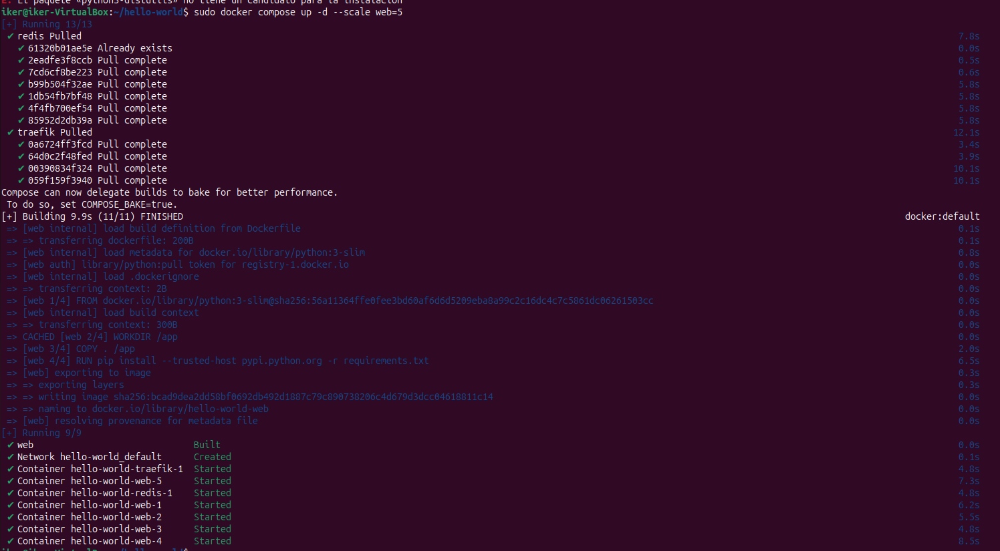

---

## Validar funcionamiento:

### En nuestro navegador:
Accedemos a la aplicación: "http://192.168.1.131:4000" Si aparece el mensaje de "Hello World!" y el hostname cambia al recargar, significa que el balanceo esta funcionando correctamente.

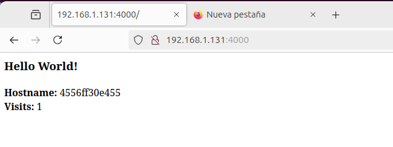 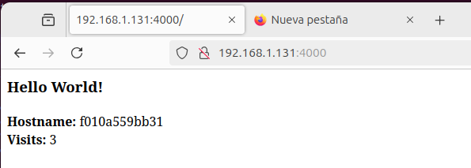

Tambien lo podremos comprobar desde el dashboard de Traefik. Ya que se puede observar que esta en correcto funcionamiento.
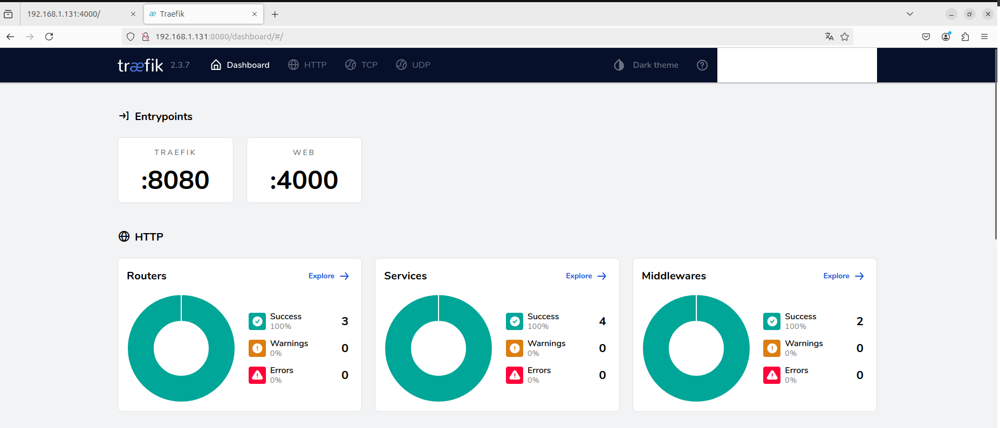


