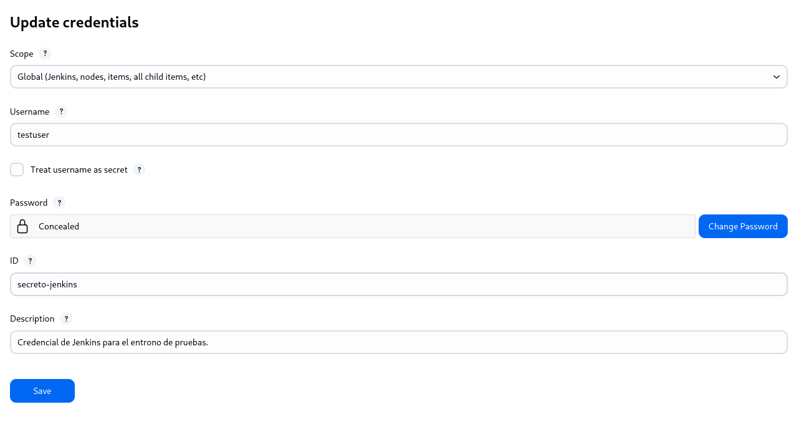
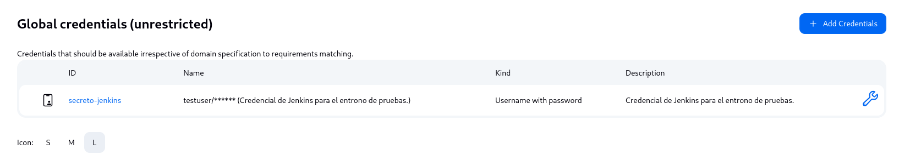
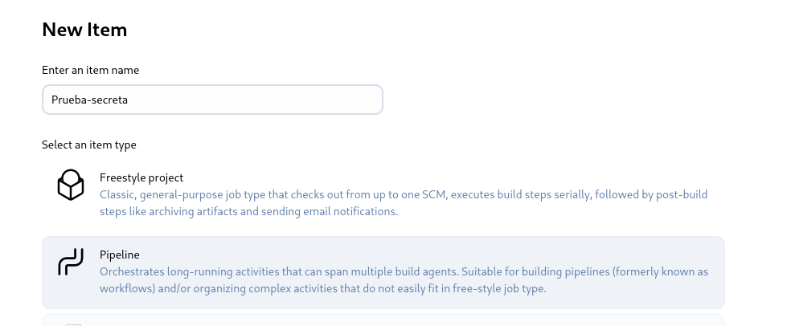
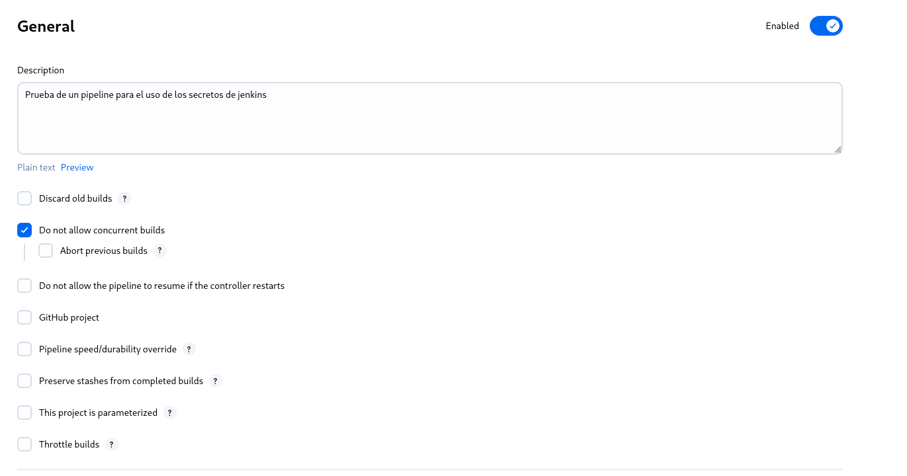
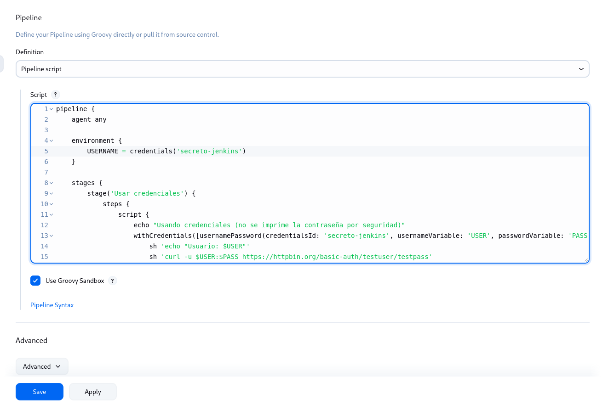
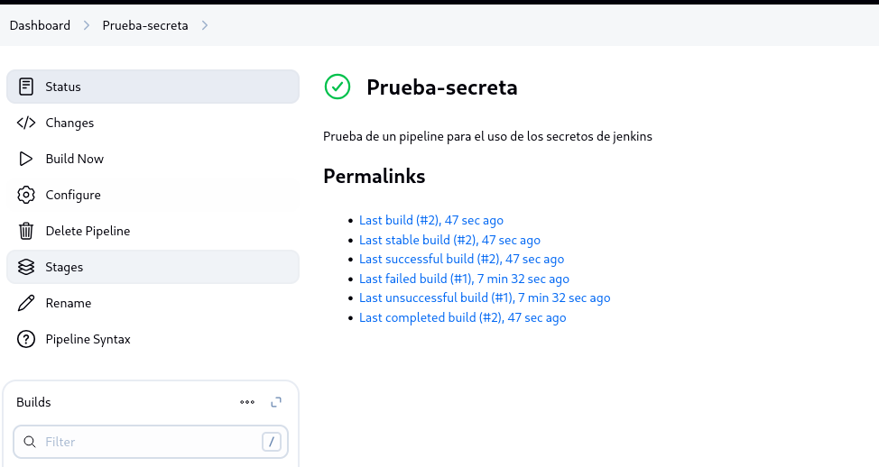
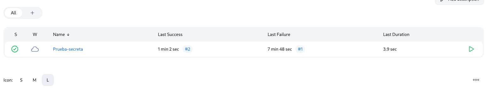
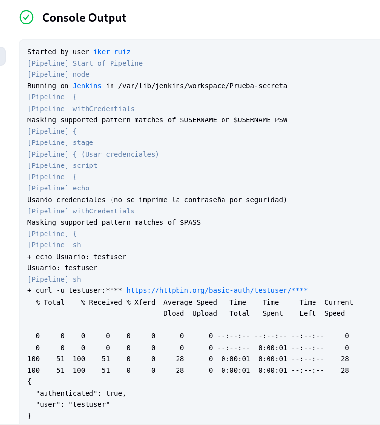
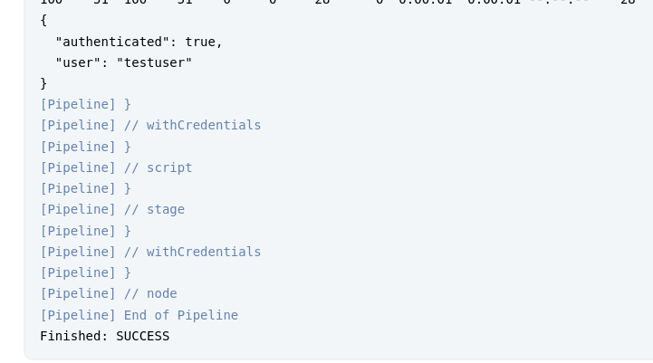

# 🔐 Configuración de Jenkins para Manejar Secretos de Manera Segura usando Credenciales.

## Descripción

Esta tarea consiste en configurar Jenkins para manejar secretos (como contraseñas, tokens o claves API) de forma segura utilizando el sistema de **Credenciales de Jenkins**. Además, se demostrará cómo usar estas credenciales dentro de un pipeline para garantizar que los secretos no se expongan directamente en el código ni los logs.

## Objetivos

- Aprender a almacenar y gestionar secretos en Jenkins usando su sistema de credenciales.
- Configurar un pipeline que acceda a estos secretos de forma segura.
- Evitar la exposición de datos sensibles en los logs o el código del pipeline.

## Pasos Realizados

1. **Creación de Credenciales en Jenkins:**
   - Ingresar a Jenkins.
   - Navegar a **Administrar Jenkins > Credenciales > Update credentials**.
   - Agregar nuevas credenciales:
       Aquí añadiremos las credenciales identificadas con el ID "secreto-jenkins". Además tanto el usuario como contraseña serán "testuser" y "testpass". Porque vamos a utilizar la web "https://httpbin.org/basic-auth/testuser/testpass", ya que es una URL de prueba que forma parte de httpbin.org, un servicio web muy útil para probar y experimentar con peticiones HTTP. Ya que en el Pipeline indicaremos que se autentique en dicha web y comproabremos si muestra o no las credenciales en los logs y en su ejecución. 

   - Asignar un ID identificador único a cada credencial.

2. **Configuración del Pipeline con Jenkinsfile:**

   - Crear un pipeline, en este caso, nombrado como "prueba-secreta".
     
     
   - Creamos un `Jenkinsfile` declarativo o scriptado.
En este caso, indicamos el script que vamos a utilizar. Como se puede observar, el script indicado es una definición de un pipeline declarativo de Jenkins que utiliza credenciales almacenadas de manera segura para autenticar una solicitud HTTP básica. 

   - Usar el bloque `environment` para referenciar las credenciales con la función `credentials()`.

  
  
   - Acceder a las credenciales en las etapas del pipeline sin imprimirlas directamente.

4. **Ejecución Correcta del Pipeline con Uso Seguro de Credenciales**
   - Ejemplo de uso de una credencial en el pipeline para conectarse a un servicio externo.
Como se puede observar, al ejecutar el pipeline, se conecta a la web indicada en el script e inicia sesión mediante las credenciales configuradas en Jenkins. Pero en los logs y en su ejecución no muestran la contraseña y la matienen oculta. Esto indica que este pipeline de Jenkins ha sido ejecutado correctamente y cumple con su objetivo principal: utilizar credenciales de forma segura sin exponer información sensible en los logs.
 
 
   - Verificación de que el secreto no aparece en la salida de la consola.
 
 

## 🧩 Conclusión
El pipeline ha demostrado ser eficaz y seguro al gestionar credenciales dentro de Jenkins. Gracias al uso del bloque Credentials, se ha evitado la exposición de contraseñas en los registros, protegiendo la información sensible del sistema. Además, la autenticación mediante curl confirma que las credenciales se usaron correctamente y de forma funcional.

Este ejemplo refleja una buena práctica para cualquier entorno de CI/CD: automatizar procesos manteniendo altos estándares de seguridad.
