# 🔐 Uso Seguro de Secretos en Jenkins con HashiCorp Vault

Este apartado demuestra cómo **configurar Jenkins para manejar secretos de forma segura** utilizando Hashicorp Vault, y cómo **acceder a esos secretos desde un pipeline declarativo**.

---

## 📦 Requisitos Previos

Antes de comenzar, deberemos asegúrarnos de tener:

- Jenkins instalado y funcionando.
- El plugin **HashiCorp Vault Plugin** instalado en Jenkins.
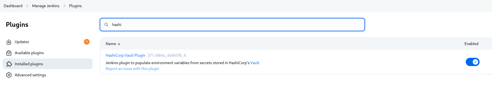
- Un token válido o mecanismo de autenticación para Vault.
- Jenkins conectado a Vault (URL, token, etc.).

---

## ⚙️ Configuración de Vault

### 1. **Inicia Vault en modo desarrollo:**

Al inciar Vault, al final de la ejecución deberemos tener en cuenta que nos mostrara nuestro "root token". Que deberemos guarda o copiar ya que será necesario a continuación.

   ```bash
   vault server -dev
   ```
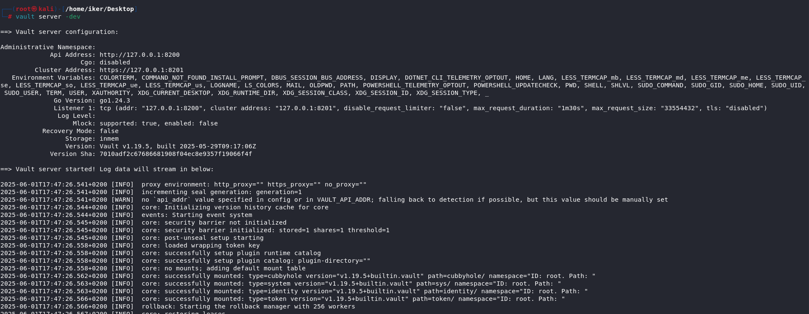
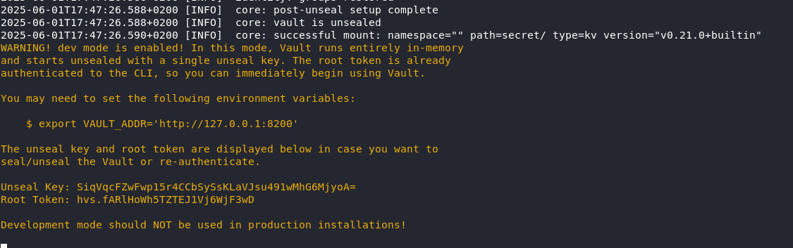

### 2. **Exportar el token y la dirección del servidor Vault:**

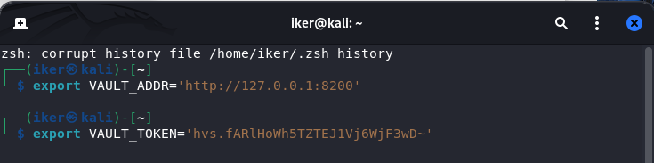

### 3. **Agregar un secreto a Vault**
En este caso, agregaremos un secreto a vault, nombrado "secretisimo".
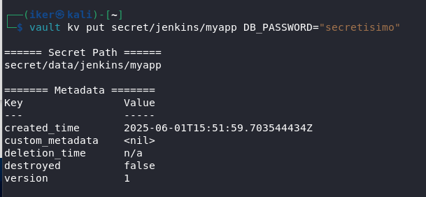

Si accedemos a la interfaz de Vault mediante el token y revisamos los secretos podremos observar que el secreto "secretisimo" se ha creado correctamente.
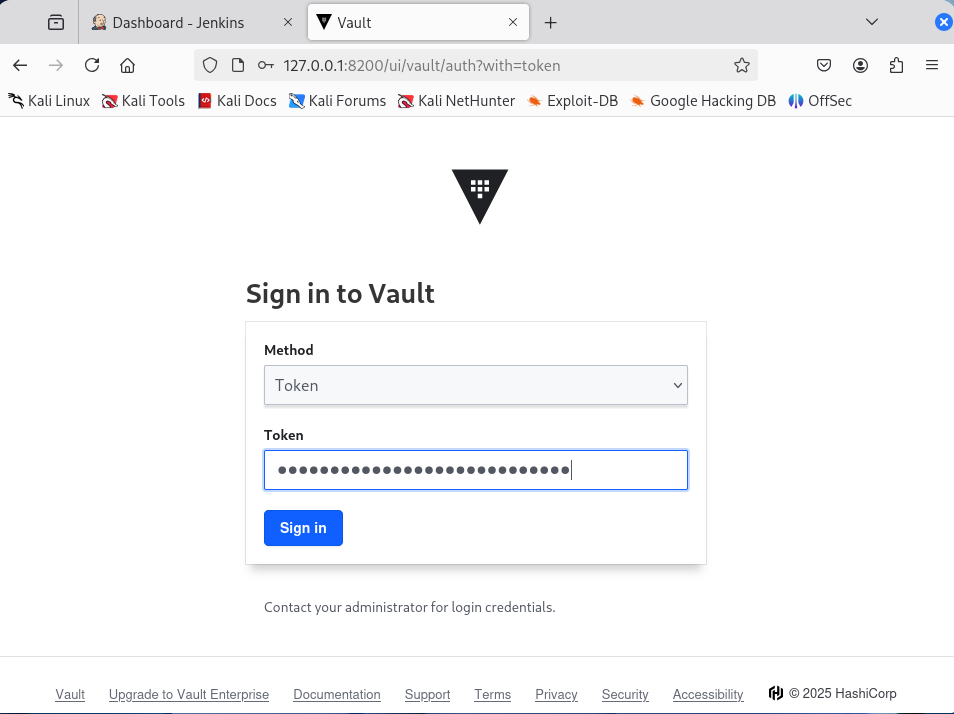
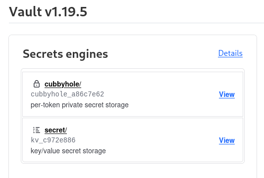
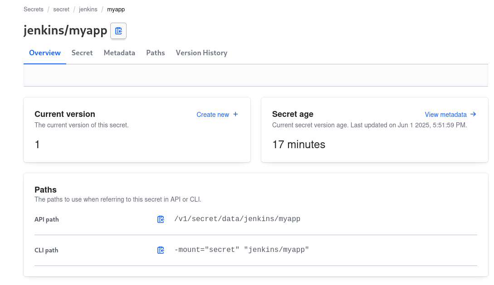

## ⚙️ Configuración de Jenkins.

### 1. **Configurar Vault en Jenkins**
Deberemos dirigirnos a la administración de Jenkins y rellenar los campos de la sección "Vault" como se muestra en la imagen. Indicando, las credenciales mediante token de Vault.
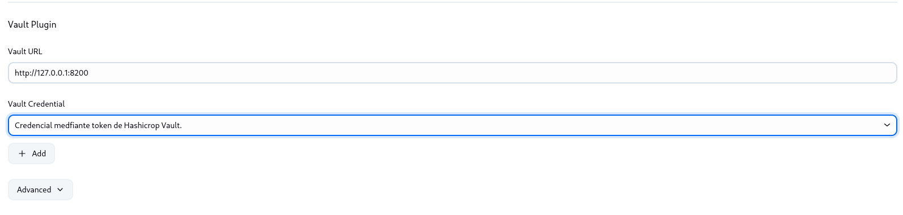


### 2. **Creación del pipeline**
Crearemos un pipeline otra vez con un script declarativo, en este caso, nombrado como "prueba-secreta-Vault". El script configurado indica un pipeline declarativo de Jenkins que accede de forma segura a un secreto almacenado en HashiCorp Vault y lo utiliza dentro de una etapa del pipeline.

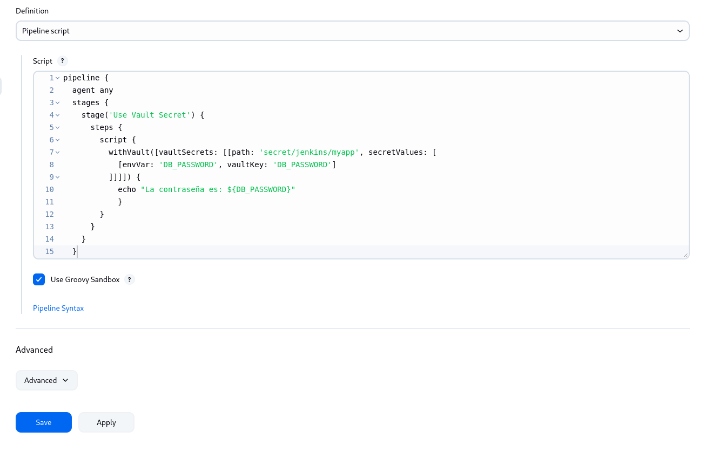

## Validación.

### 1. **Ejecución del pipeline y sus resultados.**

Al montar el pipeline, al revisar su ejecución y sus logs. Podemos observar, como efectivamente Jenkins oculta la contraseña secreta almacenada en Vault. se puede comprobar que el manejo de credenciales se realiza de manera segura. Al observar los registros (logs) de la consola, se evidencia que Jenkins utiliza correctamente los secretos almacenados en HashiCorp Vault, permitiendo que el pipeline acceda a valores como el nombre de usuario y la contraseña sin exponerlos directamente. En particular, aunque el usuario sí puede visualizarse en los logs para propósitos de verificación, la contraseña permanece oculta en todo momento. Incluso si se intentara imprimirla mediante un comando como echo, Jenkins la enmascara automáticamente para evitar su exposición. Esto confirma que la integración con Vault protege eficazmente los datos sensibles, cumpliendo con las buenas prácticas de seguridad en entornos de integración continua.
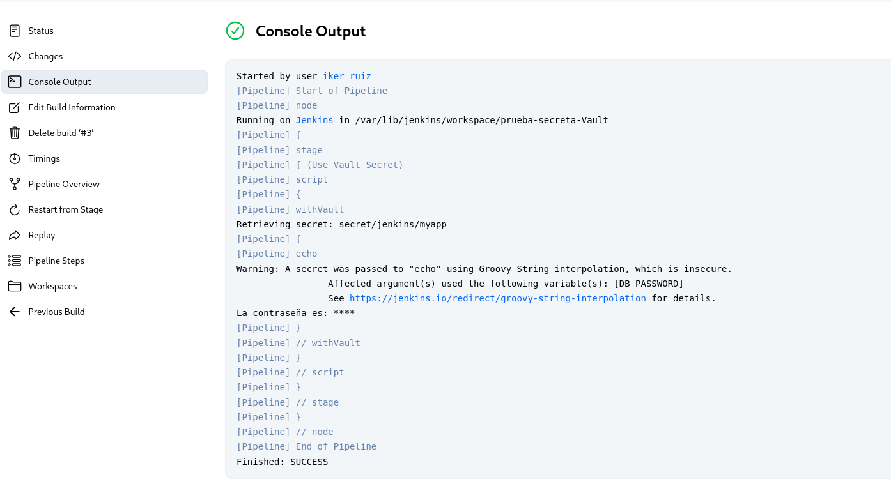
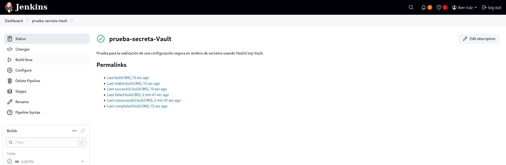
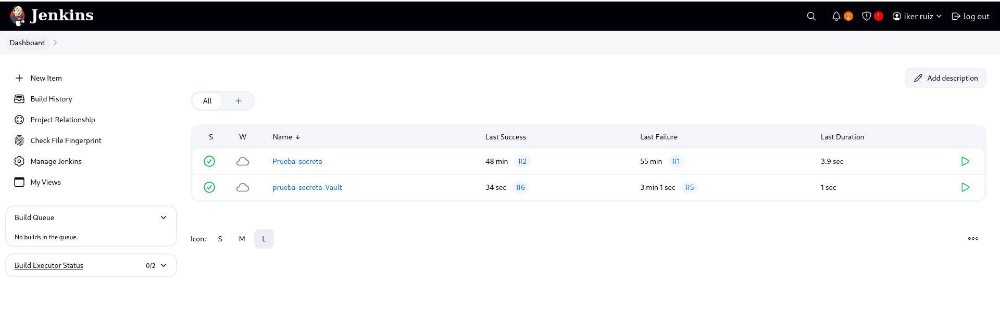

## 🧩 Conclusión General
La integración de Jenkins con HashiCorp Vault ofrece una solución robusta y segura para el manejo de secretos dentro de procesos de integración y entrega continua (CI/CD). A través de la configuración adecuada del plugin de Vault y su uso en pipelines declarativos, se garantiza que las credenciales y datos sensibles no se expongan en el código ni en los logs de ejecución.

La ejecución del pipeline demuestra que:

- Jenkins accede a los secretos almacenados en Vault de manera controlada.

- Las variables sensibles, como contraseñas, se protegen automáticamente contra exposiciones accidentales.

- Se mantiene un alto estándar de seguridad sin comprometer la automatización del flujo de trabajo.

Esta práctica no solo mejora la seguridad, sino que también promueve un entorno de desarrollo moderno, escalable y alineado con las mejores prácticas en DevOps.

